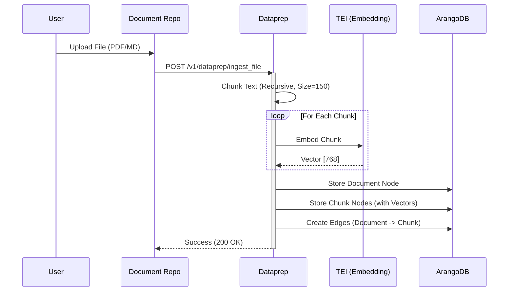
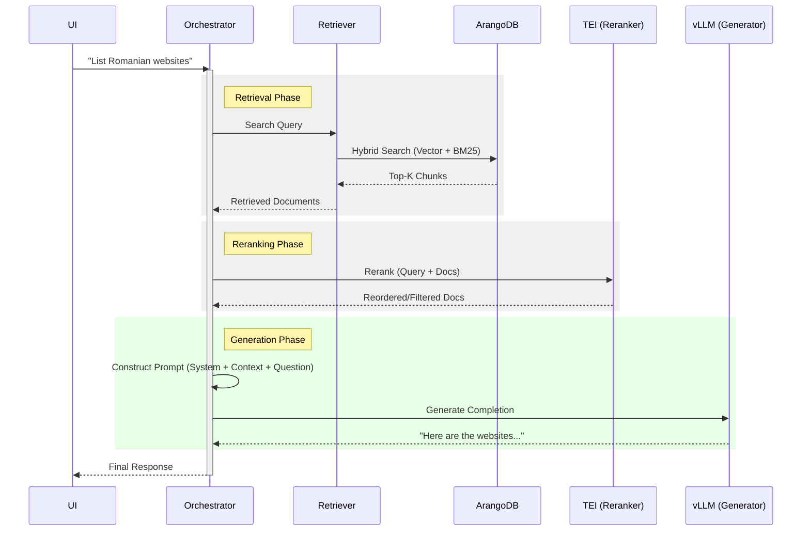

# Genie AI Architecture (6GB GPU Edition)

This document provides a high-level overview of the Genie AI platform architecture. It describes the system components, their interactions, and the specific adaptations made for the 6GB GPU configuration.

## 🏗️ System Overview

Genie AI is a **Retrieval-Augmented Generation (RAG)** platform designed to process, store, and chat with domain-specific knowledge (e.g., government services). It utilizes the **OPEA (Open Platform for Enterprise AI)** microservice architecture, customizing key components to work with **ArangoDB** as the central knowledge store (Graph + Vector).

### High-Level Container Diagram

```mermaid
graph TD
    User([User])
    style User fill:#f9f,stroke:#333,stroke-width:2px

    subgraph "Frontend Layer"
        Nginx[Nginx Reverse Proxy]
        UI[ChatQnA UI]
        Kong[Kong API Gateway]
    end

    subgraph "Application Layer"
        Backend[Gov Chat Backend (Node.js)]
        DocRepo[Document Repository]
    end

    subgraph "OPEA Microservices Layer (Genie Overlay)"
        ChatQnA[ChatQnA Orchestrator]
        Dataprep[Dataprep Service]
        Retriever[Retriever Service]
        Guardrail[Guardrail Service]
    end

    subgraph "Inference Layer (GPU)"
        vLLM[vLLM Inference Engine]
        TEI_Embed[TEI Embedding Server]
        TEI_Rerank[TEI Reranker Server]
    end

    subgraph "Data Layer"
        ArangoDB[(ArangoDB Graph/Vector)]
        Redis[(Redis Cache)]
        KongDB[(Kong Postgres)]
    end

    User -->|HTTPS| Nginx
    Nginx -->|/ (Root)| UI
    Nginx -->|/api| Kong
    
    Kong -->|/api/queries| Backend
    Kong -->|/api/documents| DocRepo

    UI -->|Chat Request| ChatQnA
    Backend -->|History/Context| ChatQnA
    
    DocRepo -->|Ingest Request| Dataprep
    Dataprep -->|Embed/Chunk| TEI_Embed
    Dataprep -->|Store| ArangoDB

    ChatQnA -->|1. Guardrail| Guardrail
    ChatQnA -->|2. Retrieve| Retriever
    ChatQnA -->|3. Rerank| TEI_Rerank
    ChatQnA -->|4. Generate| vLLM

    Retriever -->|Query| ArangoDB
    Retriever -->|Embed Query| TEI_Embed

    vLLM -->|Model Weights| GPU[GPU (6GB VRAM)]
    TEI_Embed -->|Model Weights| GPU
    TEI_Rerank -->|Model Weights| GPU
```

---

## 🧩 Key Components

### 1. Application Layer (Legacy/Sidecar)
*   **Gov Chat Backend (Node.js)**: Handles user authentication, session management, and chat history. It acts as an intermediary, enriching user queries with session context before sending them to the OPEA ChatQnA service.
*   **Document Repository**: Manages file uploads, virus scanning (ClamAV), and metadata. Triggers ingestion via the Dataprep service.
*   **Kong API Gateway**: Routes traffic between the Frontend and the various backend services (Backend, DocRepo).

### 2. OPEA Microservices (Genie AI Overlay)
This layer implements the core GenAI logic using standard OPEA interfaces but with custom implementations (`genie-ai-overlay/`) for ArangoDB integration.

*   **ChatQnA (`genieai_chatqna.py`)**: The main orchestrator. It receives the user query, coordinates the retrieval of relevant documents, reranks them, and constructs the final prompt for the LLM.
*   **Dataprep (`genieai_dataprep_arangodb.py`)**: Responsible for ingesting documents.
    *   **Logic**: Splits documents into recursive chunks.
    *   **Graph**: Links chunks to their source files and semantic labels in ArangoDB (`HAS_SOURCE` edges).
    *   **Note**: On 6GB GPU, complex LLM-based graph extraction is disabled to save VRAM.
*   **Retriever (`genieai_retriever_arangodb.py`)**: Performs hybrid search (Vector + Keyword) in ArangoDB to find relevant chunks.

### 3. Inference Layer (GPU Optimized)
These services run directly on the GPU.

*   **vLLM**: Serving the Large Language Model.
    *   **Model**: `TinyLlama/TinyLlama-1.1B-Chat-v1.0`
    *   **Context**: 2048 Tokens.
    *   **Optimization**: `dtype=half`, `gpu_utilization=0.5`.
*   **TEI (Embeddings)**: Text Embeddings Inference.
    *   **Model**: `BAAI/bge-base-en-v1.5`
    *   **Function**: vectorized text for storage and retrieval.
*   **TEI (Reranker)**: Text Search Reranking.
    *   **Model**: `cross-encoder/ms-marco-MiniLM-L-6-v2`
    *   **Function**: Re-scores retrieved results to improve relevance.

---

## 🔄 Data Flows

### Ingestion Pipeline (Data Prep)

The flow when a user uploads a new document:



### Retrieval & Generation Pipeline (RAG)

The flow when a user asks a question:



---

## 💾 Database Schema (ArangoDB)

The project uses a **Graph RAG** approach.

*   **Collections**:
    *   `GRAPH_SOURCE`: Original document metadata (Filename, Type).
    *   `GRAPH_CHUNK`: Text chunks + Embedding Vector.
*   **Edges**:
    *   `GRAPH_HAS_SOURCE`: Connects a `CHUNK` to its parent `SOURCE`.
*   **Search View**:
    *   `GRAPH_VIEW`: ArangoSearch view covering `GRAPH_CHUNK` for hybrid search capabilities.

## ⚙️ 6GB GPU Optimizations

To fit this enterprise architecture onto a consumer 6GB card:

1.  **TinyLlama**: Switched main model to 1.1B parameters.
2.  **Disabled Models**: Translation and heavy Guardrail models are disabled/stubbed.
3.  **Chunk Size**: Reduced from 500/1000 to **150** to prevent context overflow in the small model.
4.  **Context Window**: Capped at 2048 tokens in vLLM to reserve VRAM for KV Cache.
5.  **Output Tokens**: Capped at 256 to allow room for input context.
