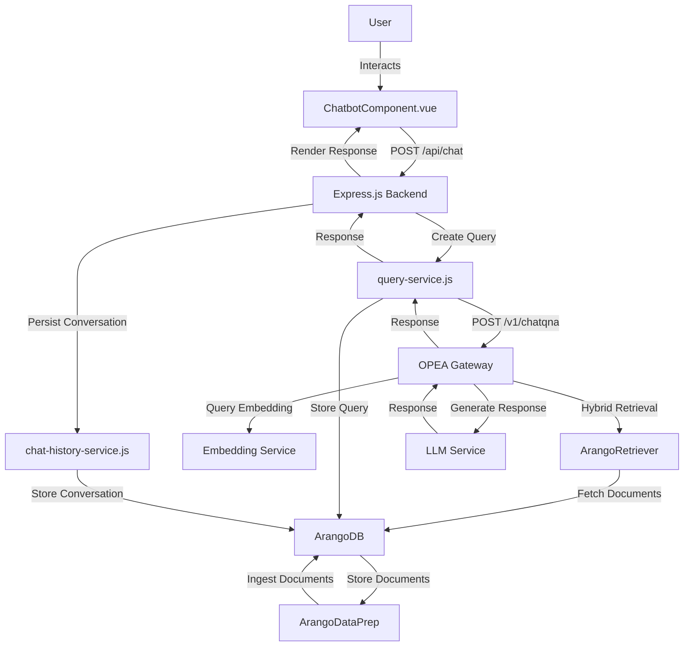
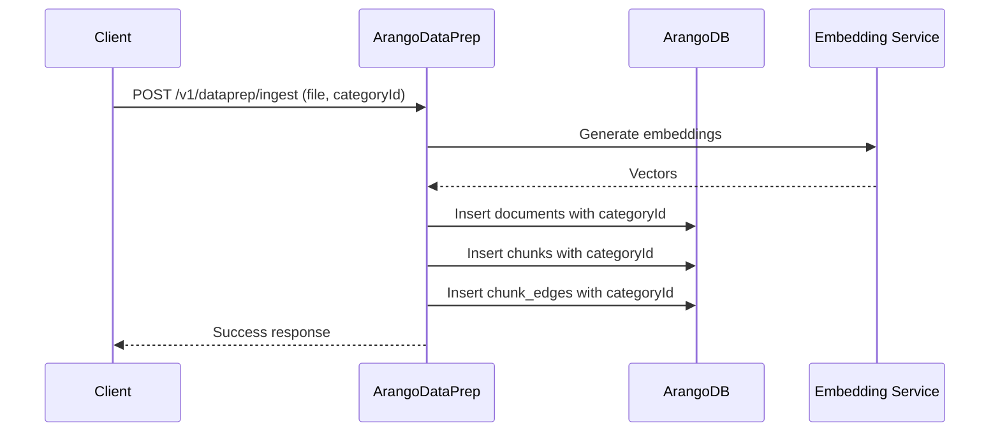
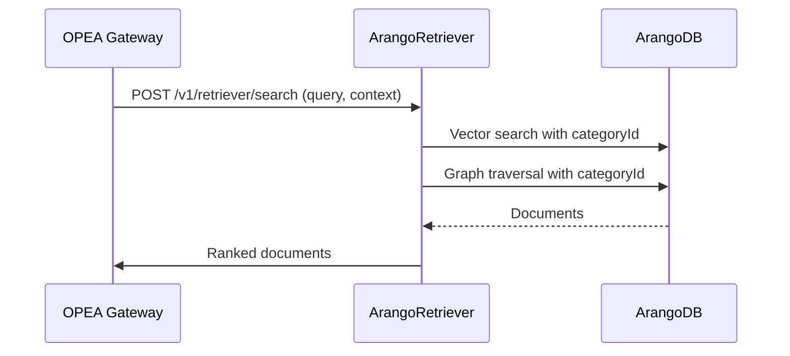
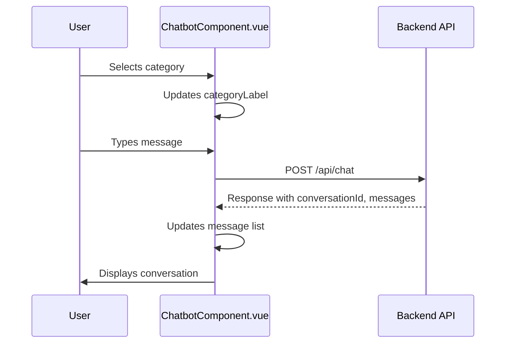
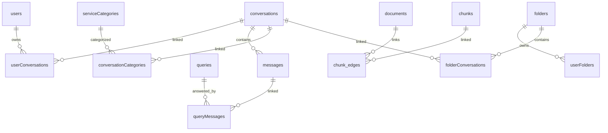

# GENIE.AI OPEA Integration Guide

This comprehensive guide details the integration of the OPEA (Open Platform for Enterprise AI) ChatQnA service with the GENIE.AI application, enabling context-aware chatbot conversations. The integration leverages a Vue.js frontend (`ChatbotComponent.vue`), a Node.js backend with services (`chat-history-service.js`, `query-service.js`), and an ArangoDB database for persistence. Additionally, it includes modifications to the OPEA megaservice, specifically the **ArangoDataPrep** and **ArangoRetriever** microservices, to handle context metadata (`categoryId`, `categoryLabel`, `language`) in queries. The guide assumes the OPEA services are running on a node with Docker containers, as shown in the provided `docker ps` output, and provides a high-level, detailed approach with code samples and diagrams.

---

## 1. Overview

### Objective
The GENIE.AI OPEA integration enables users to engage in context-aware conversations through a Vue.js chatbot interface, leveraging OPEA's Retrieval-Augmented Generation (RAG) pipeline for relevant responses. The backend persists conversations and queries in ArangoDB, while the OPEA megaservice processes queries with context metadata to enhance document retrieval. The integration supports:
- User input with conversation history and context (e.g., knowledge area/category).
- Proxying queries to OPEA's ChatQnA API (`http://e2e-109-198:8888/v1/chatqna`).
- Storing context metadata (`categoryId`) in ArangoDB graph nodes via **ArangoDataPrep**.
- Filtering retrieved documents by `categoryId` in **ArangoRetriever**'s hybrid search (vector + knowledge graph).
- Displaying responses with source documents in the frontend.

### Architecture
The system comprises:
- **Frontend**: `ChatbotComponent.vue` captures user input, displays conversations, and interacts with the backend via REST API.
- **Backend**:
  - `query-service.js`: Creates queries, communicates with OPEA, and links responses to conversations.
  - `chat-history-service.js`: Manages conversation persistence in ArangoDB.
- **Database**: ArangoDB stores conversations, messages, queries, and documents.
- **OPEA Megaservice**: A microservices pipeline including:
  - **Gateway Service** (`chatqna-xeon-backend-server`): Routes queries.
  - **Embedding Service** (`tei-embedding-serving`, `embedding`): Generates vectors.
  - **ArangoDataPrep** (`dataprep-arango-server`): Chunks and stores documents with `categoryId`.
  - **ArangoRetriever** (`retriever-arango-server`): Performs hybrid retrieval with context filtering.
  - **Reranker** (`reranker`, `tei-reranker-serving`): Ranks documents (optional).
  - **LLM Service** (`llm-textgen`): Generates responses.
  - **Translation Service** (`llm-translation`): Handles multilingual responses.
  - **Guardrail Service** (`llm-guardrail`): Ensures response safety.

### Diagram: System Architecture



### Docker Services
The following OPEA services are running on the node (`e2e-109-198`):

| Service                     | Image                                              | Port Mapping          | Description                          |
|-----------------------------|----------------------------------------------------|-----------------------|--------------------------------------|
| `chatqna-xeon-nginx-server` | `opea/nginx:latest`                                | `0.0.0.0:80->80/tcp`  | Nginx proxy for UI and API           |
| `chatqna-xeon-ui-server`    | `opea/chatqna-ui:latest`                           | `0.0.0.0:5173->5173/tcp` | OPEA UI (optional, not used here)  |
| `chatqna-xeon-backend-server` | `opea/chatqna:latest`                            | `0.0.0.0:8888->8888/tcp` | ChatQnA Gateway                   |
| `retriever-arango-server`   | `opea/retriever:latest`                            | `0.0.0.0:7025->7025/tcp` | ArangoRetriever service           |
| `dataprep-arango-server`    | `opea/dataprep:latest`                             | `0.0.0.0:6007->5000/tcp` | ArangoDataPrep service            |
| `tei-embedding-serving`     | `ghcr.io/huggingface/text-embeddings-inference`    | `0.0.0.0:7000->80/tcp` | Embedding service                 |
| `reranker`                  | `opea-reranker`                                    | `0.0.0.0:6100->8000/tcp` | Reranking service                 |
| `llm-translation`           | `opea-translation`                                 | `0.0.0.0:9030->9030/tcp` | Translation service               |
| `tei-reranker-serving`      | `ghcr.io/huggingface/text-embeddings-inference`    | `0.0.0.0:7100->80/tcp` | Reranker embeddings               |
| `llm-guardrail`             | `opea-guardrail`                                   | `0.0.0.0:9090->9090/tcp` | Guardrail service                 |
| `llm-textgen`               | `opea-textgen`                                     | `0.0.0.0:9000->9000/tcp` | LLM service                       |
| `embedding`                 | `opea-embedding`                                   | `0.0.0.0:6000->6000/tcp` | Additional embedding service      |

---

## 2. Prerequisites

### Backend Setup
- **Node.js Environment**: Node.js with dependencies (`arangojs`, `uuid`, `dotenv`, `axios`, `express`).
- **ArangoDB**: Deployed with collections (`conversations`, `messages`, `queries`, `serviceCategories`, `serviceCategoryTranslations`, `documents`, `chunks`, `chunk_edges`).
- **Environment Variables**:
  ```bash
  export ARANGO_URL=http://localhost:8529
  export ARANGO_DATABASE=genie
  export ARANGO_USERNAME=root
  export ARANGO_PASSWORD=test
  export VUE_APP_API_URL=http://localhost:3000/api
  export OPEA_API_URL=http://e2e-109-198:8888/v1/chatqna
  export HUGGINGFACEHUB_API_TOKEN=your_huggingface_token
  ```

### Frontend Setup
- **Vue.js Project**: Vue 3 with `axios` and Vuetify for UI components.
- **API Configuration**: Set `VUE_APP_API_URL` in `.env`.

### OPEA Setup
- **Running Services**: Verify Docker containers are running (`docker ps` output above).
- **Test OPEA API**:
  ```bash
  curl -X POST "http://e2e-109-198:8888/v1/chatqna" \
    -H "Content-Type: application/json" \
    -d '{"messages": [{"role": "user", "content": "Test query"}]}'
  ```
- **Test ArangoDataPrep**:
  ```bash
  curl -X POST "http://e2e-109-198:6007/v1/dataprep/ingest" \
    -H "Content-Type: multipart/form-data" \
    -F "file=@./document.pdf"
  ```
- **Test ArangoRetriever**:
  ```bash
  curl -X POST "http://e2e-109-198:7025/retriever/search" \
    -H "Content-Type: application/json" \
    -d '{"query": "test", "query_vector": [0.1, 0.2, ...]}'
  ```

### Data Preparation
- **Ingest Documents**: Use `ArangoDataPrep` to load documents with `categoryId`:
  ```bash
  curl -X POST "http://e2e-109-198:6007/v1/dataprep/ingest" \
    -H "Content-Type: multipart/form-data" \
    -F "file=@./civil_registration.pdf" \
    -F "categoryId=1"
  ```
- **ArangoDB Schema**: Disable schema validation for flexibility:
  ```aql
  db.conversations.properties({ schema: null });
  db.messages.properties({ schema: null });
  db.queries.properties({ schema: null });
  db.chunks.properties({ schema: null });
  db.chunk_edges.properties({ schema: null });
  ```

---

## 3. Message and Conversation Formatting

### Frontend Input Format
The frontend (`ChatbotComponent.vue`) sends queries with conversation history and context:

```json
{
  "conversationId": "1747653190597",
  "userId": "12345",
  "sessionId": "session_67890",
  "messages": [
    {"role": "user", "content": "What is the process for registering a birth certificate?"},
    {"role": "assistant", "content": "Submit a birth notification form within 30 days..."},
    {"role": "user", "content": "What documents are needed for parental identity?"}
  ],
  "context": {
    "categoryId": "1",
    "categoryLabel": "Identity & Civil Registration",
    "language": "EN"
  }
}
```

- **Fields**:
  - `conversationId`: ArangoDB `_key` from `conversations` (null for new conversations).
  - `userId`: From `users` collection.
  - `sessionId`: From `sessions` collection.
  - `messages`: Array of `{role, content}` objects for conversation history.
  - `context`: Includes `categoryId` (from `serviceCategories`), `categoryLabel` (translated name), and `language` (e.g., "EN", "FR").

### OPEA API Format
The `query-service.js` forwards the query to OPEA:

```json
{
  "messages": [
    {"role": "user", "content": "What is the process for registering a birth certificate?"},
    {"role": "assistant", "content": "Submit a birth notification form within 30 days..."},
    {"role": "user", "content": "What documents are needed for parental identity?"}
  ],
  "context": {
    "categoryId": "1",
    "categoryLabel": "Identity & Civil Registration",
    "language": "EN"
  },
  "stream": false
}
```

### Response Format
OPEA returns:

```json
{
  "response": "For parental identity, provide a valid government-issued ID such as a national ID card...",
  "metadata": {
    "source_documents": [
      {"document_id": "doc124", "text": "Parental proof of identity requires valid IDs...", "categoryId": "1"}
    ],
    "confidence_score": 0.92
  }
}
```

---

## 4. OPEA Megaservice Modifications

To handle the `context` block, we modify the **ArangoDataPrep**, **ArangoRetriever**, and **Gateway Service** components of the OPEA megaservice.

### 4.1. ArangoDataPrep Service Modifications

The **ArangoDataPrep** service (`dataprep-arango-server`, port `6007`) chunks documents, vectorizes them, and stores them in ArangoDB. We update it to store `categoryId` in graph nodes.

#### Steps
1. **Update Ingestion Endpoint**:
   Modify `/v1/dataprep/ingest` to accept `categoryId`:

   ```python
   from fastapi import FastAPI, File, UploadFile, Form
   from arango import ArangoClient
   from datetime import datetime
   import uuid

   app = FastAPI()

   @app.post("/v1/dataprep/ingest")
   async def ingest_document(file: UploadFile = File(...), categoryId: str = Form(None)):
       client = ArangoClient(hosts='http://localhost:8529')
       db = client.db('opea', username='root', password='test')
       chunks_collection = db.collection('chunks')
       edges_collection = db.collection('chunk_edges')
       documents_collection = db.collection('documents')

       # Read and chunk file
       content = await file.read()
       chunks = [content[i:i+512] for i in range(0, len(content), 512)]  # Simplified chunking
       document_id = str(uuid.uuid4())

       # Store document
       documents_collection.insert({
           '_key': document_id,
           'filename': file.filename,
           'categoryId': categoryId,
           'created_at': datetime.utcnow().isoformat()
       })

       # Store chunks with categoryId
       chunk_ids = []
       for i, chunk in enumerate(chunks):
           chunk_text = chunk.decode('utf-8')
           # Call embedding service
           async with httpx.AsyncClient() as client:
               embedding_response = await client.post(
                   'http://e2e-109-198:6000/embed',
                   json={'text': chunk_text}
               )
           chunk_doc = {
               '_key': f'{document_id}_chunk_{i}',
               'document_id': document_id,
               'text': chunk_text,
               'vector': embedding_response.json()['vector'],
               'categoryId': categoryId,
               'created_at': datetime.utcnow().isoformat()
           }
           chunks_collection.insert(chunk_doc)
           chunk_ids.append(chunk_doc['_key'])

       # Create edges
       for chunk_id in chunk_ids:
           edges_collection.insert({
               '_from': f'documents/{document_id}',
               '_to': f'chunks/{chunk_id}',
               'categoryId': categoryId
           })

       return {"status": "success", "document_id": document_id}
   ```

2. **Update ArangoDB Schema**:
   Ensure `chunks` and `chunk_edges` support `categoryId`:
   ```aql
   db.chunks.properties({ schema: {
     rule: {
       properties: {
         document_id: { type: "string" },
         text: { type: "string" },
         vector: { type: "array", items: { type: "number" } },
         categoryId: { type: ["string", "null"] },
         created_at: { type: "string" }
       },
       required: ["document_id", "text", "vector"]
     }
   }});

   db.chunk_edges.properties({ schema: {
     rule: {
       properties: {
         _from: { type: "string" },
         _to: { type: "string" },
         categoryId: { type: ["string", "null"] }
       },
       required: ["_from", "_to"]
     }
   }});
   ```

3. **Test Ingestion**:
   ```bash
   curl -X POST "http://e2e-109-198:6007/v1/dataprep/ingest" \
     -H "Content-Type: multipart/form-data" \
     -F "file=@./civil_registration.pdf" \
     -F "categoryId=1"
   ```

#### Diagram: ArangoDataPrep Flow



### 4.2. ArangoRetriever Service Modifications

The **ArangoRetriever** service (`retriever-arango-server`, port `7025`) performs hybrid retrieval (vector search + knowledge graph traversal). We update it to filter by `categoryId`.

#### Steps
1. **Update Retrieval Endpoint**:
   Modify `/v1/retriever/search` to use `context.categoryId`:

   ```python
   from fastapi import FastAPI
   from arango import ArangoClient
   import numpy as np

   app = FastAPI()

   @app.post("/v1/retriever/search")
   async def search(request: dict):
       query_text = request.get("query")
       query_vector = request.get("query_vector")
       context = request.get("context", {})
       category_id = context.get("categoryId")

       client = ArangoClient(hosts='http://localhost:8529')
       db = client.db('opea', username='root', password='test')
       chunks_collection = db.collection('chunks')

       # Vector search with category filter
       vector_query = """
           FOR chunk IN chunks
               FILTER chunk.categoryId == @categoryId OR @categoryId IS NULL
               LET similarity = COSINE_SIMILARITY(chunk.vector, @query_vector)
               SORT similarity DESC
               LIMIT 10
               RETURN { document_id: chunk.document_id, text: chunk.text, categoryId: chunk.categoryId, score: similarity }
       """
       vector_results = db.aql.execute(vector_query, bind_vars={
           'categoryId': category_id,
           'query_vector': query_vector
       }).batch()

       # Knowledge graph traversal
       graph_query = """
           FOR v, e IN 1..2 OUTBOUND 'documents/@start_doc' GRAPH 'document_graph'
               FILTER v.categoryId == @categoryId OR @categoryId IS NULL
               FILTER CONTAINS(LOWER(v.text), LOWER(@query_text))
               RETURN { document_id: v.document_id, text: v.text, categoryId: v.categoryId }
       """
       graph_results = db.aql.execute(graph_query, bind_vars={
           'start_doc': 'start_document',  # Adjust as per graph structure
           'categoryId': category_id,
           'query_text': query_text
       }).batch()

       # Combine and deduplicate
       combined_results = list(vector_results) + list(graph_results)
       unique_results = {r['document_id']: r for r in combined_results}.values()

       return {"documents": list(unique_results)}
   ```

2. **Update Graph Structure**:
   Create the knowledge graph if not already defined:
   ```aql
   CREATE GRAPH document_graph (
     chunk_edges FROM documents TO chunks
   );
   ```

3. **Test Retrieval**:
   ```bash
   curl -X POST "http://e2e-109-198:7025/retriever/search" \
     -H "Content-Type: application/json" \
     -d '{
       "query": "birth certificate registration",
       "query_vector": [0.1, 0.2, ...],
       "context": {"categoryId": "1"}
     }'
   ```

#### Diagram: ArangoRetriever Flow



### 4.3. Gateway Service Modifications

The **Gateway Service** (`chatqna-xeon-backend-server`, port `8888`) routes queries to microservices. Update it to pass the `context` block:

#### Steps
1. **Update Gateway Logic**:
   Modify `/v1/chatqna`:

   ```python
   from fastapi import FastAPI
   import httpx

   app = FastAPI()

   @app.post("/v1/chatqna")
   async def chat_qna(request: dict):
       messages = request.get("messages", [])
       context = request.get("context", {})
       stream = request.get("stream", False)

       async with httpx.AsyncClient() as client:
           # Get query embedding
           embedding_response = await client.post(
               'http://e2e-109-198:6000/embed',
               json={"text": messages[-1]["content"]}
           )
           query_vector = embedding_response.json()["vector"]

           # Retrieve documents
           retrieval_response = await client.post(
               'http://e2e-109-198:7025/retriever/search',
               json={
                   "query": messages[-1]["content"],
                   "query_vector": query_vector,
                   "context": context
               }
           )
           documents = retrieval_response.json()["documents"]

           # Generate response
           llm_response = await client.post(
               'http://e2e-109-198:9000/generate',
               json={"messages": messages, "documents": documents}
           )
           response = llm_response.json()

           # Apply translation if needed
           if context.get("language") and context["language"] != "EN":
               translation_response = await client.post(
                   'http://e2e-109-198:9030/translate',
                   json={"text": response["text"], "target_lang": context["language"]}
               )
               response["text"] = translation_response.json()["translated_text"]

       return {
           "response": response["text"],
           "metadata": {
               "source_documents": documents,
               "confidence_score": response.get("confidence", 0.9)
           }
       }
   ```

2. **Test Gateway**:
   ```bash
   curl -X POST "http://e2e-109-198:8888/v1/chatqna" \
     -H "Content-Type: application/json" \
     -d '{
       "messages": [{"role": "user", "content": "What is a birth certificate?"}],
       "context": {"categoryId": "1", "categoryLabel": "Identity & Civil Registration", "language": "EN"},
       "stream": false
     }'
   ```

---

## 5. Backend Integration

### 5.1. `query-service.js` Modifications

Enhance `query-service.js` to proxy queries to OPEA and persist conversations:

```javascript
const { Database, aql } = require('arangojs');
const { v4: uuidv4 } = require('uuid');
const { logger, dbService } = require('../shared-lib');
const axios = require('axios');

class QueryService {
  constructor() {
    this.dbService = dbService;
    this.db = null;
    this.queries = null;
    this.serviceCategories = null;
    this.services = null;
    this.analyticsService = null;
    this.chatHistoryService = null;
    this.initialized = false;
    logger.info('QueryService constructor called');
  }

  async init() {
    if (this.initialized) return;
    try {
      this.db = await this.dbService.getConnection('default');
      this.queries = this.db.collection('queries');
      this.serviceCategories = this.db.collection('serviceCategories');
      this.services = this.db.collection('services');
      this.initialized = true;
      logger.info('QueryService initialized successfully');
    } catch (error) {
      logger.error(`Error initializing QueryService: ${error.message}`, { stack: error.stack });
      throw error;
    }
  }

  async setChatHistoryService(chatHistoryService) {
    this.chatHistoryService = chatHistoryService;
    logger.info('QueryService.chat_history_service_set');
  }

  async processChatQuery(chatData) {
    const startTime = Date.now();
    try {
      logger.info('QueryService.process_chat_query_start', { userId: chatData.userId });

      // Validate input
      const requiredFields = ['userId', 'sessionId', 'messages', 'context'];
      const missingFields = requiredFields.filter(field => !chatData[field]);
      if (missingFields.length > 0) {
        throw new Error(`Missing required fields: ${missingFields.join(', ')}`);
      }
      if (!chatData.context.categoryId) {
        throw new Error('context.categoryId is required');
      }
      if (!chatData.context.language.match(/^[A-Z]{2}$/)) {
        throw new Error('Invalid language code');
      }
      if (!chatData.messages.length || !chatData.messages[chatData.messages.length - 1].content) {
        throw new Error('No valid query content provided');
      }

      // Create query in ArangoDB
      const queryData = {
        userId: chatData.userId,
        sessionId: chatData.sessionId,
        text: chatData.messages[chatData.messages.length - 1].content,
        timestamp: new Date().toISOString(),
        isAnswered: false,
        categoryId: chatData.context.categoryId
      };
      const query = await this.createQuery(queryData);
      const queryId = query._key;

      // Send to OPEA
      const opeaRequest = {
        messages: chatData.messages,
        context: chatData.context,
        stream: false
      };
      const opeaResponse = await axios.post(
        process.env.OPEA_API_URL || 'http://e2e-109-198:8888/v1/chatqna',
        opeaRequest,
        { headers: { 'Content-Type': 'application/json' }, timeout: 30000 }
      );

      const responseData = opeaResponse.data;
      const responseTime = Date.now() - startTime;

      // Update query
      await this.updateQueryResponseTime(queryId, responseTime);
      await this.markAsAnswered(queryId, responseTime);

      // Create or update conversation
      let conversation, userMessage, assistantMessage;
      if (chatData.conversationId) {
        userMessage = await this.chatHistoryService.addMessage({
          conversationId: chatData.conversationId,
          content: queryData.text,
          sender: 'user',
          timestamp: queryData.timestamp,
          userId: chatData.userId
        });
        assistantMessage = await this.chatHistoryService.addMessage({
          conversationId: chatData.conversationId,
          content: responseData.response,
          sender: 'assistant',
          timestamp: new Date().toISOString(),
          queryId: queryId,
          userId: chatData.userId,
          responseType: 'primary'
        });
        conversation = await this.chatHistoryService.getConversation(chatData.conversationId);
      } else {
        const conversationResult = await this.createConversationFromQuery(queryId, {
          responseText: responseData.response,
          tags: []
        });
        conversation = conversationResult.conversation;
        userMessage = conversationResult.userMessage;
        assistantMessage = conversationResult.assistantMessage;
      }

      // Link query to message
      await this.linkQueryToMessage(queryId, assistantMessage._key, {
        responseType: 'primary',
        confidenceScore: responseData.metadata?.confidence_score || 1.0
      });

      logger.info('QueryService.process_chat_query_success', {
        queryId,
        conversationId: conversation._key,
        durationMs: responseTime
      });

      return {
        conversationId: conversation._key,
        queryId,
        response: responseData.response,
        sourceDocuments: responseData.metadata?.source_documents || [],
        confidenceScore: responseData.metadata?.confidence_score || null,
        messages: [
          { ...userMessage, role: 'user' },
          { ...assistantMessage, role: 'assistant' }
        ]
      };
    } catch (error) {
      logger.error('QueryService.process_chat_query_failed', {
        error: error.message,
        stack: error.stack,
        durationMs: Date.now() - startTime
      });
      throw error;
    }
  }

  // Existing methods (createQuery, updateQueryResponseTime, markAsAnswered, linkQueryToMessage, etc.)
  // ... (unchanged from provided query-service.js)
}

module.exports = new QueryService();
```

### 5.2. Express.js Route
Add a route to handle chat queries:

```javascript
const express = require('express');
const router = express.Router();
const queryService = require('../services/query-service');
const authMiddleware = require('../middleware/auth-middleware');

router.use(authMiddleware.authenticate);

router.post('/chat', async (req, res) => {
  try {
    const chatData = req.body;
    const result = await queryService.processChatQuery(chatData);
    res.status(200).json(result);
  } catch (error) {
    console.error('Chat error:', error);
    res.status(500).json({ error: error.message });
  }
});

module.exports = router;
```

- Mount in `app.js`:
  ```javascript
  const chatRoutes = require('./routes/chat');
  app.use('/api', chatRoutes);
  ```

### 5.3. `chat-history-service.js`
The provided `chat-history-service.js` is used as-is to:
- Create conversations (`createConversationFromQuery`).
- Add messages (`addMessage`).
- Link queries to messages (`linkQueryToConversation`).
- Retrieve conversation details (`getConversation`).

---

## 6. Frontend Integration

### `ChatbotComponent.vue`
The Vue.js component handles user input, category selection, and conversation display:

```vue
<template>
  <v-container>
    <v-card class="chat-container">
      <v-card-title>Chatbot</v-card-title>
      <v-card-text>
        <v-select
          v-model="selectedCategory"
          :items="categories"
          item-title="name"
          item-value="id"
          label="Select Knowledge Area"
          @update:modelValue="updateCategoryLabel"
        ></v-select>
        <div class="message-list">
          <div v-for="message in messages" :key="message._key" :class="['message', message.role]">
            <strong>{{ message.role === 'user' ? 'You' : 'Assistant' }}:</strong>
            {{ message.content }}
            <div v-if="message.sourceDocuments" class="sources">
              <p>Sources:</p>
              <ul>
                <li v-for="doc in message.sourceDocuments" :key="doc.document_id">
                  {{ doc.text.substring(0, 100) }}... (ID: {{ doc.document_id }})
                </li>
              </ul>
            </div>
          </div>
        </div>
        <v-text-field
          v-model="newMessage"
          label="Type your message"
          append-inner-icon="mdi-send"
          @click:append-inner="sendMessage"
          @keyup.enter="sendMessage"
        ></v-text-field>
      </v-card-text>
    </v-card>
  </v-container>
</template>

<script>
import axios from 'axios';

export default {
  data() {
    return {
      userId: '12345', // Retrieve from auth
      sessionId: 'session_67890', // Generate or retrieve
      conversationId: null,
      messages: [],
      newMessage: '',
      selectedCategory: null,
      categoryLabel: '',
      language: 'EN',
      categories: [
        { id: '1', name: 'Identity & Civil Registration' },
        { id: '2', name: 'Healthcare & Social Services' }
        // Fetch from /api/categories
      ]
    };
  },
  methods: {
    async sendMessage() {
      if (!this.newMessage.trim() || !this.selectedCategory) {
        alert('Please select a category and enter a message');
        return;
      }

      const userMessage = {
        role: 'user',
        content: this.newMessage
      };
      this.messages.push(userMessage);
      const tempMessages = [...this.messages];

      this.newMessage = '';

      try {
        const response = await axios.post('http://localhost:3000/api/chat', {
          conversationId: this.conversationId,
          userId: this.userId,
          sessionId: this.sessionId,
          messages: tempMessages,
          context: {
            categoryId: this.selectedCategory,
            categoryLabel: this.categoryLabel,
            language: this.language
          }
        });

        const { conversationId, response, sourceDocuments, messages } = response.data;
        this.conversationId = conversationId;
        this.messages = messages.map(msg => ({
          ...msg,
          sourceDocuments: msg.role === 'assistant' ? sourceDocuments : null
        }));
      } catch (error) {
        console.error('Error sending message:', error);
        alert('Failed to get response');
        this.messages.pop();
      }
    },
    updateCategoryLabel() {
      const category = this.categories.find(c => c.id === this.selectedCategory);
      this.categoryLabel = category ? category.name : '';
    }
  }
};
</script>

<style scoped>
.chat-container {
  max-width: 600px;
  margin: auto;
}
.message-list {
  max-height: 400px;
  overflow-y: auto;
  margin-bottom: 20px;
}
.message {
  margin: 10px 0;
  padding: 10px;
  border-radius: 5px;
}
.message.user {
  background-color: #e3f2fd;
  text-align: right;
}
.message.assistant {
  background-color: #f5f5f5;
  text-align: left;
}
.sources {
  font-size: 0.8em;
  color: #666;
}
</style>
```

### Diagram: Frontend Flow



---

## 7. ArangoDB Data Model

### GENIE.AI Collections
- **conversations**: Stores conversation metadata.
  ```json
  {
    "_key": "1747653190597",
    "title": "Birth Registration Query",
    "lastMessage": "What documents are needed...",
    "messageCount": 2,
    "category": "Identity & Civil Registration"
  }
  ```
- **messages**: Stores individual messages.
  ```json
  {
    "_key": "msg123",
    "conversationId": "1747653190597",
    "content": "What documents are needed...",
    "sender": "user",
    "sequence": 1,
    "queryId": "query456"
  }
  ```
- **queries**: Stores query metadata.
  ```json
  {
    "_key": "query456",
    "userId": "12345",
    "sessionId": "session_67890",
    "text": "What documents are needed...",
    "categoryId": "1",
    "isAnswered": true,
    "responseTime": 250
  }
  ```

### OPEA Collections
- **documents**: Stores original documents.
  ```json
  {
    "_key": "doc124",
    "filename": "civil_registration.pdf",
    "categoryId": "1",
    "created_at": "2025-06-20T12:55:00Z"
  }
  ```
- **chunks**: Stores document chunks.
  ```json
  {
    "_key": "doc124_chunk_0",
    "document_id": "doc124",
    "text": "Parental proof of identity requires valid IDs...",
    "vector": [0.1, 0.2, ...],
    "categoryId": "1",
    "created_at": "2025-06-20T12:55:00Z"
  }
  ```
- **chunk_edges**: Links documents to chunks.
  ```json
  {
    "_from": "documents/doc124",
    "_to": "chunks/doc124_chunk_0",
    "categoryId": "1"
  }
  ```

### Diagram: ArangoDB Model



---

## 8. Error Handling and Validation

### Frontend
- Validate category selection and message input.
- Display errors for failed API calls.
- Revert UI state on errors (e.g., remove failed user message).

### Backend
- Validate `context` fields in `query-service.js`:
  ```javascript
  if (!chatData.context.categoryId) throw new Error('context.categoryId is required');
  ```
- Handle OPEA errors (e.g., `400`, `500`) with retries:
  ```javascript
  const response = await axios.post(opeaUrl, data, { timeout: 30000 });
  ```
- Use ArangoDB transactions for atomic operations.

### OPEA Services
- **ArangoDataPrep**: Validate `categoryId` format; handle file processing errors.
- **ArangoRetriever**: Fallback to non-filtered search if `categoryId` is null.
- **Gateway**: Propagate microservice errors to the client.

---

## 9. Testing and Validation

### Unit Tests
- **query-service.js**: Test `processChatQuery` with mock OPEA responses.
- **chat-history-service.js**: Test conversation/message creation.
- **ChatbotComponent.vue**: Test message sending and rendering.
- **ArangoDataPrep**: Test chunking and `categoryId` storage.
- **ArangoRetriever**: Test hybrid search with `categoryId`.

### Integration Tests
- Ingest a document with `categoryId=1` via `/v1/dataprep/ingest`.
- Send a query with matching `categoryId` to `/v1/chatqna`.
- Verify response documents have correct `categoryId`.
- Check conversation persistence in ArangoDB.

### Manual Testing
- Test queries with different categories and languages.
- Verify source documents in the frontend.
- Test conversation history retrieval and folder organization.

---

## 10. Deployment Considerations

### Scaling
- **OPEA**: Use Kubernetes for microservice scaling.
- **Backend**: Deploy Node.js with PM2 or Docker.
- **ArangoDB**: Use a cluster with sharding for `chunks`.

### Security
- **Authentication**: Add JWT to `/api/chat` for `userId` verification.
- **OPEA**: Configure mTLS or API tokens.
- **ArangoDB**: Secure with TLS and role-based access.

### Monitoring
- Monitor ArangoDB query performance.
- Log `categoryId` usage for analytics.
- Use Prometheus/Grafana for OPEA service metrics.

---

## 11. Future Enhancements
- **Streaming Responses**: Support `stream: true` for real-time UI updates.
- **Multiple Categories**: Allow multiple `categoryId` values in `context`.
- **Feedback UI**: Add feedback submission in `ChatbotComponent.vue`.
- **Multilingual UI**: Use `serviceCategoryTranslations` for dynamic labels.

---

This consolidated guide provides a complete blueprint for integrating OPEA ChatQnA with GENIE.AI, including modifications to handle context metadata. The solution leverages existing Docker services on `e2e-109-198` and ensures robust, context-aware conversations. Let me know if you need further details or specific implementations!