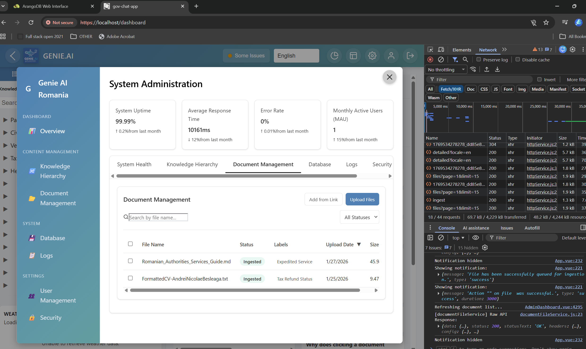
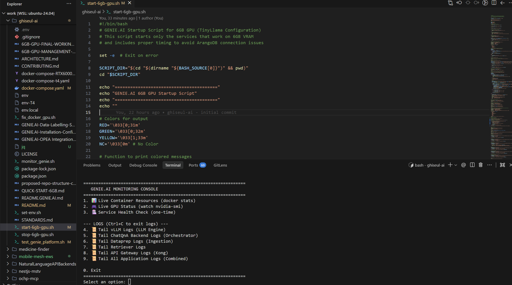

# Ghiseul AI - Genie AI Replica (6GB GPU Edition)

This is a local replica of the GENIE.AI platform, optimized to run on consumer hardware with limited VRAM (6GB), for development and testing purposes.

It has some Romanian localizations and added scripts for setup and monitoring, and implements an AI trainable chatbot with a full RAG (Retrieval Augmented Generation) pipeline using OPEA microservices, ArangoDB, and vLLM.

## 🚀 Features

*   **RAG Pipeline**: ChatQnA backend with ArangoDB vector store.
*   **Optimized Models**:
    *   **LLM**: TinyLlama-1.1B (Context window: 1024/2048 tokens).
    *   **Embeddings**: BGE-Base-En-v1.5.
    *   **Reranker**: BGE-Reranker-Base.
*   **Custom Dataprep**: Enhanced ingestion service supporting recursive chunking and graph linking.
*   **Interactive UI**: User Chat Interface.

## 📋 Prerequisites

*   Linux OS (tested on Ubuntu WSL).
*   **Docker** & **Docker Compose**.
*   **NVIDIA GPU** (min 6GB VRAM) with NVIDIA CUDA Container Toolkit installed.
*   `jq` and `curl` (for testing scripts).

## 🛠️ Quick Start

### 1. Start the Platform
Use the optimized start script to launch all services in the correct order:
```bash
./start-6gb-gpu.sh
```
*Allows ~2-3 minutes for the first launch as models may need to be downloaded (internally) and services initialized.*

*Follow docs in .md text files for more information on initialization and usage.*

*Make sure the infrastructure services are started and configured as in: GENIE.AI-Installation-Configuration-Guide.md : Step 4 -> Step 7, or run the setup_genie_env.sh script.*

### 2. Monitor Status
Launch the interactive monitoring console to check container health, GPU usage, and logs:
```bash
./monitor_genie.sh
```

### 3. Access the Application
*   **Frontend UI**: [http://localhost:5173](http://localhost:5173)
*   **Backend API**: [http://localhost:8888/v1/chatqna](http://localhost:8888/v1/chatqna)
*   **ArangoDB Dashboard**: [http://localhost:8529](http://localhost:8529) (User: `root`, Pass: `test`)

### 4. Stop the Platform
To gracefully stop all containers:
```bash
./stop-6gb-gpu.sh
```

## 🧪 Testing & Validation

Run the automated test suite to verify the entire pipeline (Ingestion -> Retrieval -> Generation):
```bash
./test_genie_platform.sh
```

## 📂 Project Structure

*   `genie-ai-overlay/` - Custom source code overlaying standard OPEA components.
    *   `dataprep/` - Custom ingestion logic.
    *   `core/` - Shared protocols.
*   `docker-compose.yaml` - Main service orchestration.
*   `.env` - Configuration variables (Optimized for 6GB VRAM).

## ⚠️ Known Limitations (6GB Config)
*   LLM context window is limited to **1024/2048 tokens**. Long documents should be ingested with smaller chunks (current `chunk_size=150`).
*   **Advanced guardrails and translation services are disabled to save VRAM.**
*   Ingestion uses a simplified flow (no LLM-based graph extraction).

## 🔧 Troubleshooting

If queries fail or services hang:
1.  Check VRAM usage with `./monitor_genie.sh` (Option 2).
2.  Tail logs for vLLM: `./monitor_genie.sh` (Option 4).
3.  Restart specific services: `docker-compose restart <service_name>`.


## LICENSE
Apache License 2.0
- Andrei Besleaga Nicolae
- UNICC-ITU Genie AI
- OPEA


## RUNNING EXAMPLE
- Document ingestion:
 
 - UI Interface:
 
 - System monitoring:
 
