# GENIE.AI - RAG Chatbot Framework Backend

This repository contains the backend services that power the GENIE.AI RAG (Retrieval-Augmented Generation) chatbot framework. GENIE.AI is a comprehensive enterprise chatbot platform that leverages OPEA (Open Platform for Enterprise AI) for LLM hosting and access, providing intelligent conversational AI capabilities with advanced user management, analytics, and administrative tools.

## Table of Contents

- [Overview](#overview)
- [Application Architecture](#application-architecture)
- [Bootstrap Process](#bootstrap-process)
- [OPEA Integration](#opea-integration)
- [Service Architecture](#service-architecture)
- [Controllers & Middleware](#controllers--middleware)
- [Shared Libraries](#shared-libraries)
- [Service Dependencies](#service-dependencies)
- [Database Schema](#database-schema)
- [Security System](#security-system)
- [API Layer](#api-layer)
- [Setup and Configuration](#setup-and-configuration)
- [Development](#development)
- [Deployment](#deployment)
- [Security Considerations](#security-considerations)

## Overview

GENIE.AI is designed as a microservices-based RAG chatbot framework that provides:

- **RAG-Powered Conversations**: Intelligent responses using OPEA's LLM hosting platform
- **Knowledge Base Management**: Service categorization and retrieval for context-aware responses
- **Conversation Management**: Persistent chat history with folder organization and threading
- **Advanced Analytics**: Real-time monitoring of chatbot performance and user interactions
- **Multi-language Support**: Internationalized responses and content management
- **Enterprise Features**: User management, security scanning, and administrative dashboards

## Application Architecture

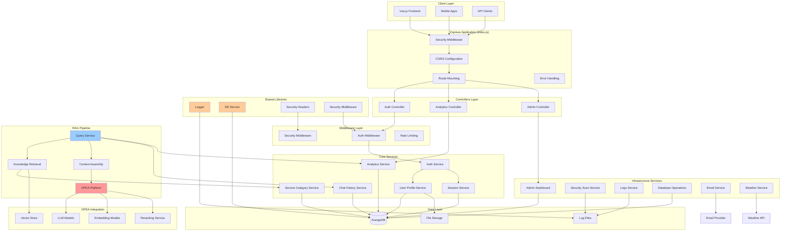

## Bootstrap Process

The GENIE.AI backend follows a structured bootstrap process managed by `index.js`:

### Bootstrap Sequence Diagram

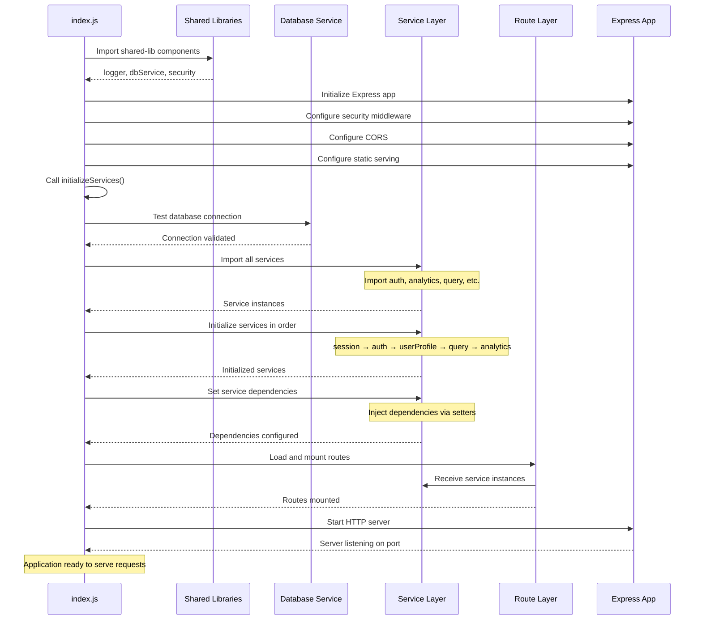

### Detailed Bootstrap Steps

#### 1. Environment Validation
```javascript
// Validate required environment variables
const requiredEnvVars = ['ARANGO_URL', 'ARANGO_DB', 'ARANGO_USERNAME', 'ARANGO_PASSWORD'];
const missingEnvVars = requiredEnvVars.filter(key => !process.env[key]);
```

#### 2. Express Application Setup
```javascript
const app = express();

// Security configuration
app.disable('etag');
app.disable('x-powered-by');
app.set('trust proxy', 1);

// Apply security middleware
app.use(securityHeaders);
app.use(helmet(cspOptions));
app.use(cors(corsOptions));
```

#### 3. Service Initialization Pipeline
```javascript
async function initializeServices() {
  // Step 1: Database connection test
  const defaultConnection = await dbService.getConnection('default');
  
  // Step 2: Import services with error handling
  const services = await importAllServices();
  
  // Step 3: Initialize in dependency order
  const initOrder = [
    { service: sessionService, name: 'SessionService' },
    { service: authService, name: 'AuthService', 
      preInit: () => authService.setSessionService(sessionService) },
    { service: serviceCategoryService, name: 'ServiceCategoryService' },
    // ... additional services
  ];
  
  // Step 4: Set cross-service dependencies
  queryService.setAnalyticsService(analyticsService);
  queryService.setChatHistoryService(chatHistoryService);
  
  return services;
}
```

#### 4. Route Configuration
```javascript
const routeConfigs = [
  { file: 'auth-routes', paths: ['/api/auth'], service: authService },
  { file: 'query-routes', paths: ['/api/queries'], service: queryService },
  { file: 'analytics-routes', paths: ['/api/analytics'], service: analyticsService },
  // ... additional routes
];

// Mount routes with services
for (const config of routeConfigs) {
  const routeInstance = require(`./routes/${config.file}`)(config.service);
  app.use(config.paths[0], routeInstance);
}
```

## OPEA Integration

GENIE.AI leverages OPEA (Open Platform for Enterprise AI) as the core AI engine for LLM processing.

### OPEA Request Flow Diagram

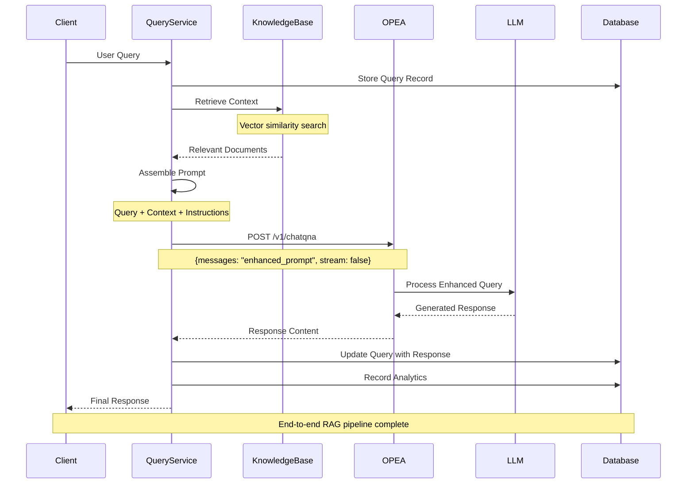

### OPEA Configuration

```javascript
// OPEA Service Configuration
const opeaHost = process.env.OPEA_HOST || 'e2e-109-198';
const opeaPort = process.env.OPEA_PORT || '8888';
const opeaUrl = `http://${opeaHost}:${opeaPort}/v1/chatqna`;

// OPEA Request Implementation
const opeaPayload = {
  messages: enhancedPrompt,  // User query + retrieved context
  stream: false
};

const opeaResponse = await axios.post(opeaUrl, opeaPayload);
const responseContent = opeaResponse.data.choices[0].message.content;
```

## Service Architecture

### Service Component Diagram

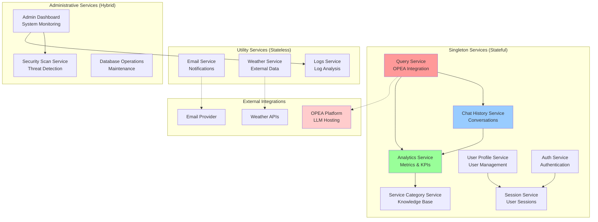

### Service Types Classification

| Service Type | Pattern | State Management | Initialization | OPEA Role |
|--------------|---------|------------------|----------------|-----------|
| **Singleton Services** | Single instance per application | Internal state + DB connections | `await service.init()` | Core RAG pipeline |
| **Utility Services** | Functional, minimal state | Configuration only | Simple instantiation | Data augmentation |
| **Administrative Services** | Hybrid stateless/cached | Performance caching | Init + periodic cleanup | Monitoring & security |

### Service Dependency Injection

```javascript
// Dependency injection pattern used throughout
class QueryService {
  setAnalyticsService(analyticsService) {
    this.analyticsService = analyticsService;
  }
  
  setChatHistoryService(chatHistoryService) {
    this.chatHistoryService = chatHistoryService;
  }
}

// Bootstrap process sets dependencies
queryService.setAnalyticsService(analyticsService);
queryService.setChatHistoryService(chatHistoryService);
```

## Controllers & Middleware

### Controller Architecture

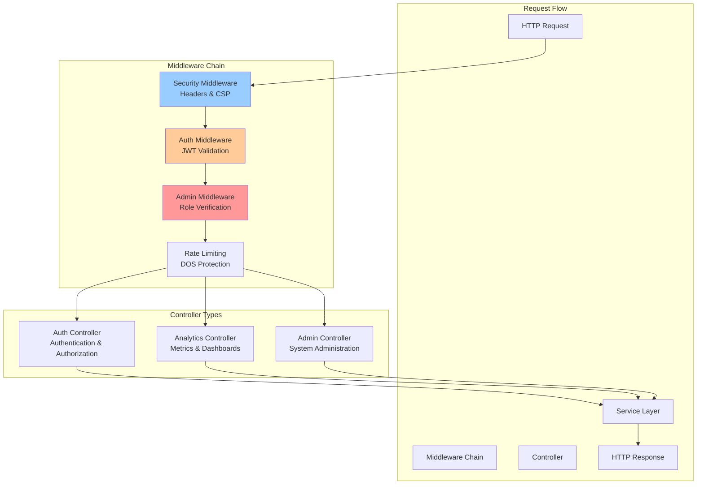

### Authentication Middleware Flow

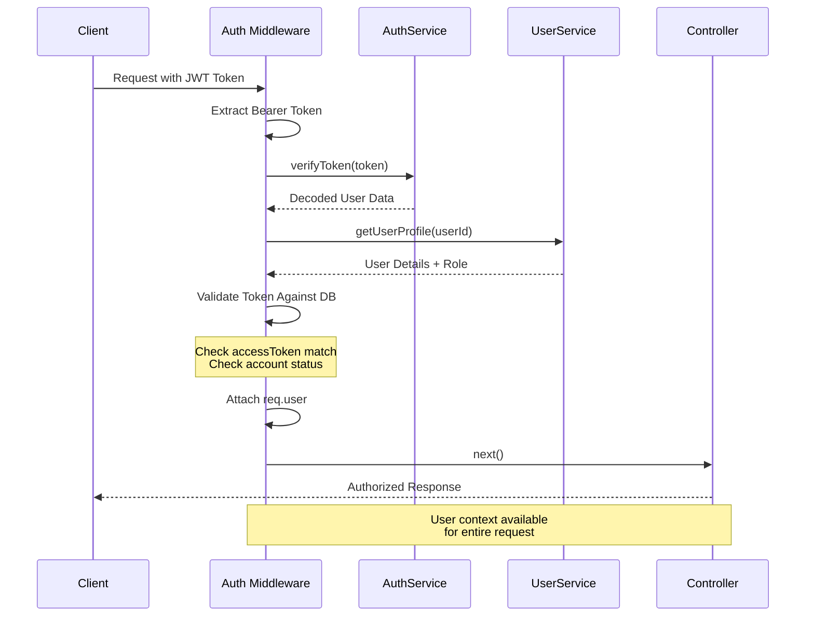

### Controller Implementations

#### Auth Controller
```javascript
class AuthController {
  constructor(authService) {
    this.authService = authService;
  }

  async login(req, res) {
    const { loginName, encPassword } = req.body;
    const result = await this.authService.login(loginName, encPassword);
    res.json(result);
  }
  
  async register(req, res) {
    const userData = req.body;
    userData.frontendUrl = getFrontendUrl(req);
    userData.backendUrl = getBackendUrl(req);
    const result = await this.authService.register(userData);
    res.status(201).json(result);
  }
}
```

#### Analytics Controller
```javascript
class AnalyticsController {
  constructor(analyticsService) {
    this.analyticsService = analyticsService;
  }

  async getDashboardAnalytics(req, res) {
    const { startDate, endDate, locale } = req.query;
    const dashboardData = await this.analyticsService
      .getDashboardAnalytics(startDate, endDate, locale);
    res.json(dashboardData);
  }
}
```

### Middleware Chain Configuration

```javascript
// Security middleware stack
app.use(securityHeaders);
app.use(helmet(cspOptions));
app.use(cors(corsOptions));
app.use(SecurityMiddleware.applySecurityMiddleware);

// Request processing middleware
app.use(bodyParser.json());
app.use(morgan(customFormat));

// Route-specific middleware
app.use('/api/admin', authMiddleware.authenticate, authMiddleware.isAdmin);
app.use('/api/users', authMiddleware.authenticate);
```

## Shared Libraries

### Shared Library Architecture

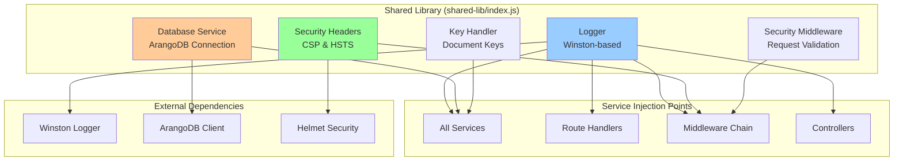

### Shared Library Components

#### Logger Service
```javascript
// Centralized logging with Winston
const logger = winston.createLogger({
  level: process.env.LOG_LEVEL || 'info',
  format: winston.format.combine(
    winston.format.timestamp(),
    winston.format.errors({ stack: true }),
    winston.format.json()
  ),
  transports: [
    new winston.transports.Console(),
    new winston.transports.DailyRotateFile({
      filename: 'logs/combined-%DATE%.log',
      datePattern: 'YYYY-MM-DD',
      maxSize: '20m',
      maxFiles: '14d'
    })
  ]
});
```

#### Database Service
```javascript
// Singleton database connection manager
class DatabaseService {
  async getConnection(name = 'default') {
    if (!this.connections[name]) {
      this.connections[name] = new Database({
        url: process.env.ARANGO_URL,
        databaseName: process.env.ARANGO_DB,
        auth: {
          username: process.env.ARANGO_USERNAME,
          password: process.env.ARANGO_PASSWORD
        }
      });
    }
    return this.connections[name];
  }
}
```

#### Security Headers
```javascript
// Standardized security headers
const securityHeaders = (req, res, next) => {
  res.setHeader('X-Content-Type-Options', 'nosniff');
  res.setHeader('X-Frame-Options', 'DENY');
  res.setHeader('X-XSS-Protection', '1; mode=block');
  res.setHeader('Strict-Transport-Security', 
    'max-age=31536000; includeSubDomains; preload');
  next();
};
```

### Library Injection Pattern

```javascript
// Services import shared libraries
const { logger, dbService, securityHeaders } = require('../shared-lib');

class ServiceExample {
  constructor() {
    this.logger = logger;        // Injected logger
    this.dbService = dbService;  // Injected DB service
  }
  
  async init() {
    this.db = await this.dbService.getConnection('default');
    this.logger.info('Service initialized with shared DB connection');
  }
}
```

## Service Dependencies

### Dependency Graph

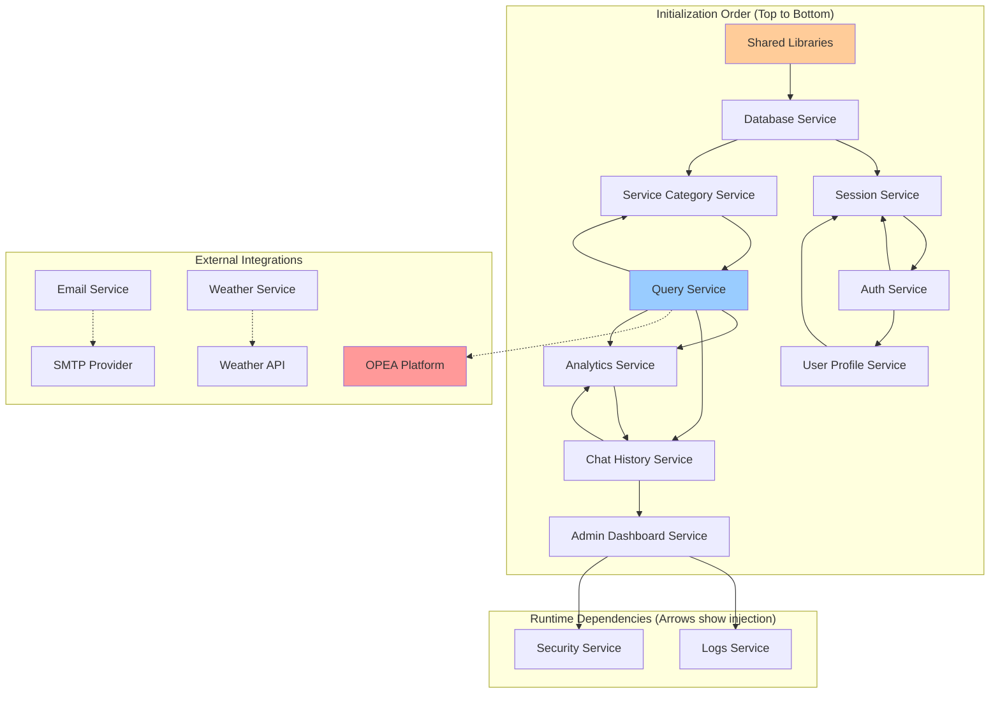

### Dependency Injection Implementation

```javascript
// Step 1: Initialize core services
await sessionService.init();
await authService.init();

// Step 2: Set immediate dependencies
authService.setSessionService(sessionService);
userProfileService.setSessionService(sessionService);

// Step 3: Initialize dependent services
await userProfileService.init();
await queryService.init();
await analyticsService.init();

// Step 4: Set cross-service dependencies
queryService.setAnalyticsService(analyticsService);
queryService.setChatHistoryService(chatHistoryService);
chatHistoryService.setAnalyticsService(analyticsService);
```

### Service Communication Patterns

#### 1. Direct Method Calls (Primary Pattern)
```javascript
// Query Service calling Analytics Service
await this.analyticsService.recordQuery(queryDoc);
```

#### 2. Event-Driven Communication (Future Enhancement)
```javascript
// Potential event-driven pattern
eventBus.emit('query.created', { queryId, userId, metrics });
```

#### 3. Database-Mediated Communication
```javascript
// Services communicate via shared database state
await this.db.collection('analytics').save(analyticsRecord);
```

## Database Schema

### ArangoDB Collections Overview

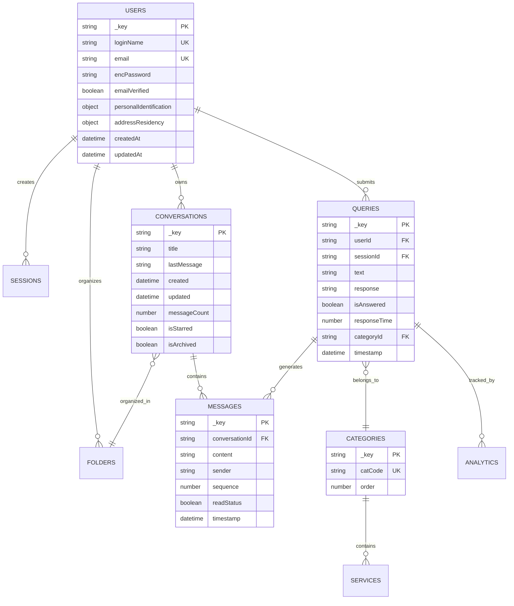

### Collections by Purpose

#### Core RAG Collections
- `queries` - User queries and OPEA responses
- `conversations` - Multi-turn conversation threads  
- `messages` - Individual messages in conversations
- `queryMessages` - Links queries to conversation responses

#### Knowledge Base Collections
- `serviceCategories` - Knowledge categories for context retrieval
- `services` - Specific knowledge items within categories
- `serviceCategoryTranslations` - Multi-language category names
- `serviceTranslations` - Localized service descriptions

#### User Management Collections
- `users` - User profiles and authentication data
- `sessions` - Active user sessions with expiration
- `userSessions` - User-session relationship edges
- `verificationTokens` - Email verification tokens
- `passwordResetTokens` - Password reset tokens

#### Analytics Collections
- `analytics` - Query metrics and response analytics
- `events` - System events and user interactions

#### Organization Collections
- `folders` - Conversation folder structure
- `folderConversations` - Folder-conversation relationships
- `userFolders` - User folder permissions

## Security System

### Security Architecture

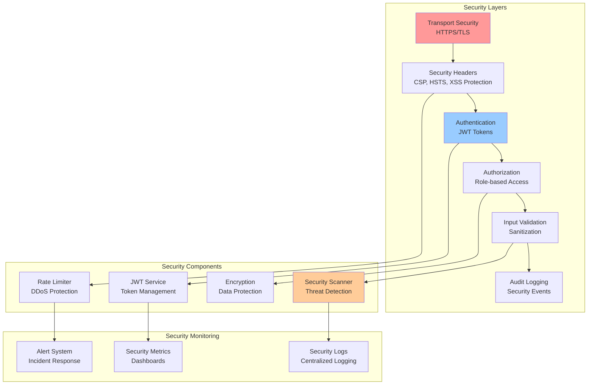

### Authentication Flow

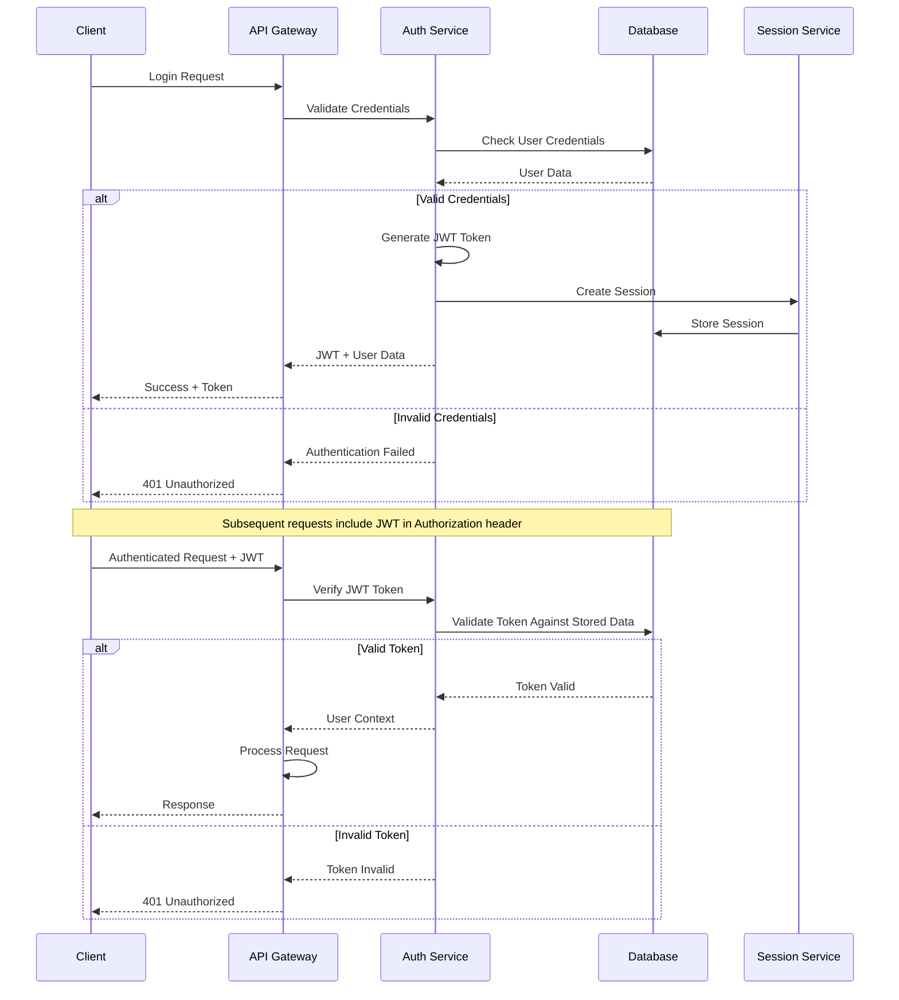

### Security Features

#### JWT Token Security
```javascript
// JWT token generation with user context
const token = jwt.sign({
  userId: user._key,
  loginName: user.loginName,
  email: user.email
}, process.env.JWT_SECRET, { 
  expiresIn: process.env.JWT_EXPIRES_IN || '24h' 
});
```

#### Role-Based Authorization
```javascript
// Admin middleware checking user roles
async function isAdmin(req, res, next) {
  const user = await authService.getUserById(req.user.userId);
  const isAdmin = parseInt(user._key) <= 10 || user.role === 'Admin';
  
  if (!isAdmin) {
    return res.status(403).json({ error: 'Admin access required' });
  }
  next();
}
```

#### Security Headers
```javascript
// Content Security Policy
const cspOptions = {
  directives: {
    defaultSrc: ["'self'"],
    scriptSrc: ["'self'", "cdn.jsdelivr.net"],
    styleSrc: ["'self'", "'unsafe-inline'"],
    connectSrc: ["'self'", "https://api.open-meteo.com"],
    frameSrc: ["'none'"],
    objectSrc: ["'none'"]
  }
};
```

## API Layer

### API Structure

```mermaid
graph TB
    subgraph "API Endpoints"
        AUTH_API["/api/auth<br/>Authentication"]
        QUERY_API["/api/queries<br/>RAG Queries"]
        CHAT_API["/api/chat-history<br/>Conversations"]
        ANALYTICS_API["/api/analytics<br/>Metrics"]
        ADMIN_API["/api/admin<br/>Administration"]
        USER_API["/api/users<br/>User Management"]
    end
    
    subgraph "Route Handlers"
        AUTH_ROUTES[auth-routes.js]
        QUERY_ROUTES[query-routes.js]
        CHAT_ROUTES[chat-history-routes.js]
        ANALYTICS_ROUTES[analytics-routes.js]
        ADMIN_ROUTES[admin-routes.js]
        USER_ROUTES[user-routes.js]
    end
    
    subgraph "Middleware Stack"
        SECURITY_MW[Security Middleware]
        AUTH_MW[Auth Middleware]
        ADMIN_MW[Admin Middleware]
        VALIDATE_MW[Validation Middleware]
    end
    
    AUTH_API --> AUTH_ROUTES
    QUERY_API --> QUERY_ROUTES
    CHAT_API --> CHAT_ROUTES
    ANALYTICS_API --> ANALYTICS_ROUTES
    ADMIN_API --> ADMIN_ROUTES
    USER_API --> USER_ROUTES
    
    AUTH_ROUTES --> SECURITY_MW
    QUERY_ROUTES --> AUTH_MW
    CHAT_ROUTES --> AUTH_MW
    ANALYTICS_ROUTES --> AUTH_MW
    ADMIN_