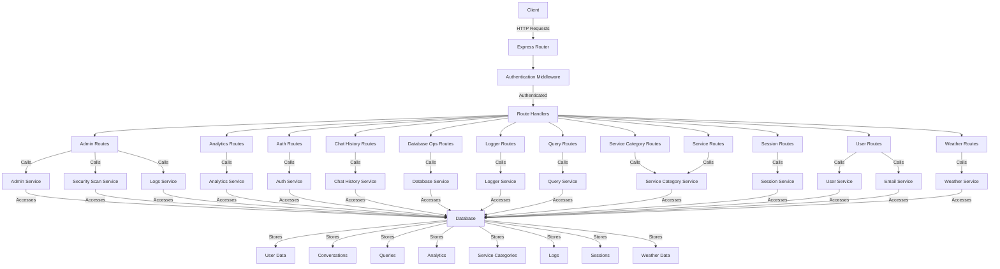

# GENIE.AI - RAG Framework API Routes

This document provides an overview of the API routes available in the GENIE.AI backend, a Retrieval-Augmented Generation (RAG) framework designed to implement advanced RAG use cases. These RESTful endpoints enable interaction with services that power the application, supporting features such as chat history management, database operations, authentication, analytics, session management, user profile management, and weather data retrieval.

## Table of Contents

- [GENIE.AI - RAG Framework API Routes](#genieai---rag-framework-api-routes)
  - [Table of Contents](#table-of-contents)
  - [Overview](#overview)
  - [Architecture Diagram](#architecture-diagram)
  - [Authentication and Security](#authentication-and-security)
  - [Route Groups](#route-groups)
    - [Admin Routes](#admin-routes)
      - [Key Parameters](#key-parameters)
      - [Services Called](#services-called)
      - [Security](#security)
    - [Analytics Routes](#analytics-routes)
      - [Key Parameters](#key-parameters-1)
      - [Services Called](#services-called-1)
      - [Security](#security-1)
    - [Authentication Routes](#authentication-routes)
      - [Key Parameters](#key-parameters-2)
      - [Services Called](#services-called-2)
      - [Security](#security-2)
    - [Chat History Routes](#chat-history-routes)
      - [Key Parameters](#key-parameters-3)
      - [Services Called](#services-called-3)
      - [Security](#security-3)
    - [Database Operations Routes](#database-operations-routes)
      - [Key Parameters](#key-parameters-4)
      - [Services Called](#services-called-4)
      - [Security](#security-4)
    - [Logger Routes](#logger-routes)
      - [Key Parameters](#key-parameters-5)
      - [Services Called](#services-called-5)
      - [Security](#security-5)
    - [Query Routes](#query-routes)
      - [Key Parameters](#key-parameters-6)
      - [Services Called](#services-called-6)
      - [Security](#security-6)
    - [Service Category Routes](#service-category-routes)
      - [Key Parameters](#key-parameters-7)
      - [Services Called](#services-called-7)
      - [Security](#security-7)
    - [Service Routes](#service-routes)
      - [Key Parameters](#key-parameters-8)
      - [Services Called](#services-called-8)
      - [Security](#security-8)
    - [Session Routes](#session-routes)
      - [Key Parameters](#key-parameters-9)
      - [Services Called](#services-called-9)
      - [Security](#security-9)
    - [User Routes](#user-routes)
      - [Key Parameters](#key-parameters-10)
      - [Services Called](#services-called-10)
      - [Security](#security-10)
    - [Weather Routes](#weather-routes)
      - [Key Parameters](#key-parameters-11)
      - [Services Called](#services-called-11)
      - [Security](#security-11)
  - [Error Handling](#error-handling)
  - [Testing](#testing)
    - [Using Swagger UI](#using-swagger-ui)
    - [Using the Integration Test](#using-the-integration-test)

## Overview

GENIE.AI is a RAG framework that integrates retrieval and generation capabilities to provide intelligent, context-aware responses for various use cases. The API is organized into logical route groups, each corresponding to specific functionalities:

- **Admin Routes**: Manage system health, logs, security scans, and database operations.
- **Analytics Routes**: Provide insights into user interactions and system performance.
- **Authentication Routes**: Handle user authentication, registration, and password management.
- **Chat History Routes**: Manage user conversations, messages, and folder organization.
- **Database Operations Routes**: Perform database maintenance tasks like reindexing and backups.
- **Logger Routes**: Configure and manage logging settings.
- **Query Routes**: Handle user queries and their integration with conversations.
- **Service Category Routes**: Manage service categories and their hierarchies.
- **Service Routes**: Provide access to service information.
- **Session Routes**: Manage user sessions.
- **User Routes**: Manage user profiles and account settings.
- **Weather Routes**: Retrieve weather data for specified locations.

All routes are documented with Swagger annotations for easy reference and testing via the Swagger UI.

## Architecture Diagram

Below is a high-level architecture diagram illustrating how the API routes interact with services and the database in the GENIE.AI framework:



This diagram shows the flow from client requests through the Express router, authentication middleware, and route handlers to the respective services, which interact with the database to store and retrieve data.

## Authentication and Security

All routes, except specific authentication endpoints (e.g., `/auth/login`, `/auth/register`, `/users/check-email`), require JWT-based authentication. The `authMiddleware.authenticate` function validates the JWT token in the `Authorization` header (Bearer scheme). Admin-only routes additionally use `authMiddleware.isAdmin` to restrict access to users with administrative privileges.

- **JWT Token**: Must be included in the `Authorization` header as `Bearer <token>`.
- **Error Responses**:
  - **401 Unauthorized**: Missing or invalid token.
  - **403 Forbidden**: Insufficient permissions (e.g., non-admin accessing admin routes).
- **Token Management**:
  - Tokens are refreshed via `/auth/refresh-token`.
  - Expired tokens trigger a 401 response, requiring clients to re-authenticate.
  - Password reset and email verification use secure tokens with expiration.

## Route Groups

### Admin Routes

**Base Path**: `/api/admin`

| Method | Endpoint | Description |
|--------|----------|-------------|
| GET | `/system-health` | Retrieve system health metrics |
| GET | `/database/stats` | Get database statistics |
| GET | `/logs` | Retrieve system logs with filtering |
| POST | `/logs/rollover` | Trigger log rotation |
| GET | `/user-stats` | Get user statistics |
| GET | `/security-metrics` | Retrieve security metrics |
| POST | `/security-scan` | Run a security scan |
| GET | `/security/last-scan` | Get details of the last security scan |
| POST | `/diagnostics` | Run system diagnostics |
| GET | `/logs/summary` | Get logs summary by type and service |
| GET | `/logs/search` | Search logs with filtering |
| GET | `/logs/debug-yesterday` | Retrieve debug logs for yesterday |
| POST | `/database-operations/reindex` | Reindex database |
| POST | `/database-operations/backup` | Backup database |
| POST | `/database-operations/optimize` | Optimize database |
| GET | `/users/search` | Search users with filtering |

#### Key Parameters
- `limit`, `offset`: Pagination for logs and user searches.
- `level`, `service`: Filter logs by level (INFO, WARNING, ERROR) or service name.
- `term`, `field`: Search criteria for logs and users.
- `date`, `dateRange`, `startDate`, `endDate`: Filter logs by date or range.

#### Services Called
- **Admin Service**: Handles system health, database stats, user stats, diagnostics, and database operations.
- **Security Scan Service**: Manages security scans and metrics.
- **Logs Service**: Retrieves log summaries and performs searches.

#### Security
- All routes require JWT authentication (`authMiddleware.authenticate`).
- All routes require admin privileges (`authMiddleware.isAdmin`).
- Security scan endpoints interact with `securityScanService` to monitor failed login attempts and suspicious activities.

### Analytics Routes

**Base Path**: `/api/analytics`

| Method | Endpoint | Description |
|--------|----------|-------------|
| GET | `/dashboard` | Get dashboard analytics within a date range |
| GET | `/metric/:metric` | Get specific metric data (e.g., totalQueries, uniqueUsers) |
| GET | `/` | Get general analytics with optional filters |
| GET | `/timeseries/:metricType` | Get time series data for a metric |
| POST | `/events` | Track a user event for analytics |
| GET | `/records` | Get raw analytics records with pagination |
| GET | `/events` | Get raw event records with pagination |
| GET | `/satisfaction/gauge` | Get satisfaction gauge data |
| GET | `/satisfaction/heatmap` | Get satisfaction heatmap data |

#### Key Parameters
- `startDate`, `endDate`: Define the analysis period (ISO format).
- `metricType`: Type of metric (e.g., queries, users).
- `interval`: Time grouping (hourly, daily, weekly, monthly).
- `locale`: Language code for category names (e.g., en, fr, sw).
- `filters`: JSON string for additional filtering criteria.

#### Services Called
- **Analytics Service**: Handles all analytics data retrieval and event tracking, interacting with the database to store and query analytics and event records.

#### Security
- All routes require JWT authentication (`authMiddleware.authenticate`).
- No admin privileges required, allowing authenticated users to access analytics.

### Authentication Routes

**Base Path**: `/api/auth`

| Method | Endpoint | Description |
|--------|----------|-------------|
| POST | `/refresh-token` | Refresh JWT token using a refresh token |
| POST | `/register` | Register a new user |
| POST | `/login` | Authenticate user and return access token |
| POST | `/logout` | Invalidate user token |
| GET | `/me` | Get current user information |
| GET | `/verify-email/:token` | Verify user email using token |
| GET | `/verify-email-success` | Display email verification result |
| POST | `/resend-verification` | Resend verification email |
| POST | `/reset-password` | Initiate password reset |
| POST | `/validate-token` | Validate password reset token |
| POST | `/reset-password/confirm` | Reset password using token |
| POST | `/change-password` | Change password for authenticated user |
| POST | `/cleanup-tokens` | Clean up expired tokens (admin only) |

#### Key Parameters
- `refreshToken`: Required for token refresh.
- `loginName`, `email`, `encPassword`: Required for registration and login.
- `token`: Used for email verification and password reset.
- `currentPassword`, `newPassword`: Required for password changes.

#### Services Called
- **Auth Service**: Manages user authentication, token generation, and verification processes.
- **Auth Controller**: Handles business logic for authentication routes.

#### Security
- `/register`, `/login`, `/reset-password`, `/resend-verification`, `/validate-token`, `/verify-email/:token`, `/verify-email-success` do not require authentication.
- Other routes require JWT authentication (`authMiddleware.authenticate`).
- `/cleanup-tokens` requires admin privileges (`authMiddleware.isAdmin`).
- Passwords are encrypted/hashed client-side before transmission.

### Chat History Routes

**Base Path**: `/api/chat`

| Method | Endpoint | Description |
|--------|----------|-------------|
| GET | `/conversations` | Get user conversations with pagination |
| GET | `/conversations/:conversationId` | Get conversation details |
| POST | `/conversations` | Create a new conversation |
| PATCH | `/conversations/:conversationId` | Update conversation properties |
| DELETE | `/conversations/:conversationId` | Delete a conversation |
| GET | `/conversations/:conversationId/messages` | Get conversation messages |
| POST | `/conversations/:conversationId/messages` | Add message to conversation |
| POST | `/conversations/:conversationId/messages/read` | Mark messages as read |
| GET | `/query/:queryId/messages` | Get messages for a query |
| GET | `/messages/:messageId/query` | Get originating query for a message |
| POST | `/query/:queryId/conversation` | Create conversation from query |
| GET | `/search` | Search conversations |
| GET | `/recent` | Get recent conversations |
| GET | `/stats` | Get conversation statistics |
| GET | `/folders` | Get user folders |
| POST | `/folders` | Create a new folder |
| GET | `/folders/:folderId` | Get folder details |
| PATCH | `/folders/:folderId` | Update folder properties |
| DELETE | `/folders/:folderId` | Delete a folder |
| GET | `/folders/shared` | Get shared folders |
| GET | `/folders/search` | Search folders |
| POST | `/folders/reorder` | Reorder folders |
| GET | `/folders/:folderId/path` | Get folder path |
| POST | `/folders/:folderId/conversations/:conversationId` | Add conversation to folder |
| DELETE | `/folders/:folderId/conversations/:conversationId` | Remove conversation from folder |
| GET | `/conversations/:conversationId/folder` | Get conversation's folder |
| POST | `/conversations/:conversationId/move` | Move conversation between folders |
| POST | `/folders/:folderId/share` | Share folder with another user |
| DELETE | `/folders/:folderId/share/:targetUserId` | Remove folder share |
| GET | `/folders/:folderId/users` | Get users with folder access |
| GET | `/conversations/:conversationId/export` | Export conversation (PDF/JSON) |

#### Key Parameters
- `userId`: Extracted from request for user-specific operations.
- `conversationId`, `folderId`, `queryId`, `messageId`: Identifiers for specific resources.
- `limit`, `offset`: Pagination for conversations, messages, and folders.
- `includeArchived`, `filterStarred`, `searchTerm`: Filtering options for conversations and folders.
- `title`, `tags`, `categoryId`: Metadata for conversations and folders.
- `format`: Export format (pdf, json).

#### Services Called
- **Chat History Service**: Manages conversations, messages, folders, and their relationships, including CRUD operations and linking queries to conversations.

#### Security
- All routes require JWT authentication (`authMiddleware.authenticate`).
- User ID extraction ensures operations are restricted to the authenticated user’s data.
- Folder sharing includes permission checks (viewer, editor, contributor roles).
- Conversation and folder operations validate ownership and permissions.

### Database Operations Routes

**Base Path**: `/api/database`

| Method | Endpoint | Description |
|--------|----------|-------------|
| POST | `/reindex` | Reindex database |
| POST | `/backup` | Backup database |
| POST | `/optimize` | Optimize database |

#### Key Parameters
- None (operations are system-wide).

#### Services Called
- **Database Service**: Performs database maintenance tasks like reindexing, backups, and optimization.

#### Security
- All routes require JWT authentication (`authMiddleware.authenticate`).
- Typically restricted to admin users (assumed to be enforced in the route or service layer).

### Logger Routes

**Base Path**: `/api/logger`

| Method | Endpoint | Description |
|--------|----------|-------------|
| POST | `/configure` | Reconfigure logger settings |
| POST | `/rollover` | Trigger log rotation |

#### Key Parameters
- `level`: Logging level (error, warn, info, debug).
- `errorMaxSize`, `combinedMaxSize`: Maximum log file sizes.
- `errorMaxFiles`, `combinedMaxFiles`: Maximum days to keep log files.
- `zippedArchive`: Whether to compress rotated logs.

#### Services Called
- **Logger Service**: Uses `reconfigureLogger` and `triggerLogRollover` functions to manage logging configuration.

#### Security
- Both routes require JWT authentication (`authMiddleware.authenticate`).
- Both routes require admin privileges (`authMiddleware.isAdmin`).

### Query Routes

**Base Path**: `/api/queries`

| Method | Endpoint | Description |
|--------|----------|-------------|
| POST | `/` | Create a new query |
| GET | `/:queryId` | Get query by ID |
| POST | `/:queryId/feedback` | Add feedback to a query |
| PATCH/PUT | `/:queryId/answered` | Mark a query as answered |
| GET | `/` | Search queries with criteria |
| PATCH | `/:queryId/responsetime` | Update query response time |
| GET | `/:queryId/conversations` | Get conversations for a query |
| POST | `/:queryId/conversation` | Create conversation from query |
| POST | `/:queryId/link/:messageId` | Link query to message |

#### Key Parameters
- `userId`, `sessionId`, `text`: Required for creating queries.
- `queryId`, `messageId`: Identifiers for specific resources.
- `responseTime`: Time in milliseconds for query response.
- `rating`, `comment`: Feedback details.
- `limit`, `offset`: Pagination for search.
- `categoryId`, `serviceId`, `isAnswered`, `startDate`, `endDate`: Search criteria.

#### Services Called
- **Query Service**: Manages query creation, retrieval, feedback, and linking to conversations and messages.

#### Security
- All routes require JWT authentication (`authMiddleware.authenticate`).
- User-specific operations validate `userId` to ensure data access restrictions.

### Service Category Routes

**Base Path**: `/api/service-categories`

| Method | Endpoint | Description |
|--------|----------|-------------|
| GET | `/categories` | Get all categories with services |
| GET | `/categories/:categoryId` | Get a specific category with services |
| GET | `/search` | Search categories and services |
| POST | `/` | Create or update categories |
| DELETE | `/:categoryId` | Delete a category |
| POST | `/init` | Initialize default categories |

#### Key Parameters
- `locale`: Language code (e.g., en, fr, sw) for localized content.
- `categoryId`: Unique identifier for a category.
- `query`: Search string for categories and services.
- `categories`: Array of category data for creation/update.

#### Services Called
- **Service Category Service**: Manages category and service data, including CRUD operations and search.

#### Security
- All routes require JWT authentication (`authMiddleware.authenticate`).

### Service Routes

**Base Path**: `/api/services`

| Method | Endpoint | Description |
|--------|----------|-------------|
| GET | `/categories` | Get all categories with services |
| GET | `/categories/:categoryId` | Get a specific category with services |
| GET | `/search` | Search categories and services |

#### Key Parameters
- `locale`: Language code for localized content.
- `categoryId`: Unique identifier for a category.
- `query`: Search string for services.

#### Services Called
- **Service Category Service**: Shared with service category routes for managing category and service data.

#### Security
- All routes require JWT authentication (`authMiddleware.authenticate`).

### Session Routes

**Base Path**: `/api/sessions`

| Method | Endpoint | Description |
|--------|----------|-------------|
| POST | `/` | Create a new session |
| GET | `/:sessionId` | Get session by ID |
| PATCH | `/:sessionId/end` | End a session |
| PATCH | `/:sessionId/keepalive` | Keep a session alive |
| GET | `/user/:userId` | Get all sessions for a specific user |

#### Key Parameters
- `userId`: ID of the user creating or querying the session.
- `sessionId`: Unique identifier for a session.
- `deviceInfo`: Object containing device type, browser, and OS information.
- `activeOnly`: Boolean to filter only active sessions.

#### Services Called
- **Session Service**: Manages session creation, retrieval, updates, and termination, storing session data in the database.

#### Security
- `/sessions` (POST) does not require authentication to allow session creation before login.
- All other routes require JWT authentication (`authMiddleware.authenticate`).
- Session operations validate `userId` to ensure users can only access their own sessions.

### User Routes

**Base Path**: `/api/users`

| Method | Endpoint | Description |
|--------|----------|-------------|
| GET | `/debug-routes` | List all registered user routes for debugging |
| PUT | `/email` | Update user’s email address with verification |
| GET | `/check-email` | Check if an email is available |
| GET | `/:userId` | Get user profile by ID |
| POST | `/` | Create a new user profile with optional file uploads |
| DELETE | `/:userId` | Delete user profile by ID |
| GET | `/` | Search users with pagination and criteria |
| POST | `/reset-data` | Reset user profile data while preserving account |
| POST | `/delete` | Permanently delete user account with password verification |
| PUT | `/:userId` | Update user profile or role (admin only for role updates) |
| PUT | `/:userId/role` | Update user role (admin only) |
| POST | `/admin/users/:userId/resend-verification` | Resend verification email (admin only) |
| POST | `/admin/users/:userId/force-logout` | Force logout a user (admin only) |

#### Key Parameters
- `userId`: Identifier for the user being queried or modified.
- `email`, `password`: Required for email updates and account deletion.
- `data`, `files`: Profile data and optional file uploads for profile creation/update.
- `role`: User role (User, Admin, Manager) for role updates.
- `limit`, `offset`: Pagination for user searches.
- `email`, `role`: Search criteria for users.

#### Services Called
- **User Service**: Manages user profile creation, retrieval, updates, and deletion, including role management and email verification.
- **Email Service**: Sends verification emails for email updates and admin-initiated verification.

#### Security
- `/check-email` does not require authentication to allow pre-registration checks.
- All other routes require JWT authentication (`authMiddleware.authenticate`).
- Role updates and admin actions (`/admin/users/*`) require admin privileges (`authMiddleware.isAdmin`).
- Email updates and account deletion require password verification.
- File uploads are limited to 10MB and stored in memory using `multer`.

### Weather Routes

**Base Path**: `/api/weather`

| Method | Endpoint | Description |
|--------|----------|-------------|
| POST | `/` | Get weather data for a specified location |

#### Key Parameters
- `latitude`, `longitude`: Coordinates for the location (optional, defaults to server location).
- `userId`: ID of the user requesting weather data.

#### Services Called
- **Weather Service**: Retrieves current weather and forecast data, storing user-specific weather requests in the database.

#### Security
- Requires JWT authentication (`authMiddleware.authenticate`).
- Validates latitude (-90 to 90) and longitude (-180 to 180) to ensure valid coordinates.

## Error Handling

All routes follow a consistent error handling approach:

1. **400 Bad Request**: Missing or invalid fields (e.g., missing `userId`, invalid `latitude`).
2. **401 Unauthorized**: Missing or invalid JWT token.
3. **403 Forbidden**: Insufficient permissions (e.g., non-admin accessing admin routes).
4. **404 Not Found**: Resource not found (e.g., user, session, conversation).
5. **500 Server Error**: Unexpected errors during processing.

Error responses are formatted consistently:
```json
{
  "message": "Error message details"
}
```

Some routes include additional error details (e.g., `error` field with stack trace in development).

## Testing

Routes can be tested using tools like Postman or the Swagger UI.

### Using Swagger UI

1. Access the Swagger documentation at `/api-docs`.
2. Authenticate using a valid JWT token.
3. Select an endpoint to test.
4. Provide required parameters and execute the request.
5. View the response in the Swagger UI.

### Using the Integration Test

Run the integration test script to verify connections between services:

```bash
node verify-integration.js
```

This script tests the integration between the query service, analytics service, and other components of the GENIE.AI framework, ensuring that queries and feedback are correctly recorded in analytics.

---

This updated `README.md` reflects the current state of the GENIE.AI API routes, including the newly added session, user, and weather routes. The architecture diagram has been updated to include the new services, and the detailed route descriptions ensure clarity for developers implementing RAG use cases.