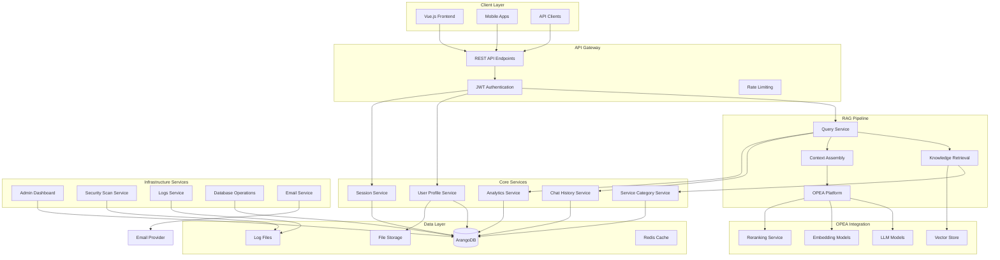
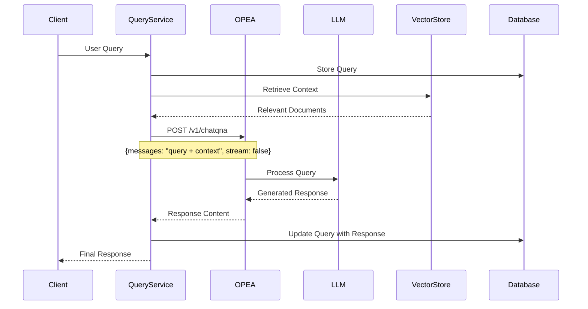
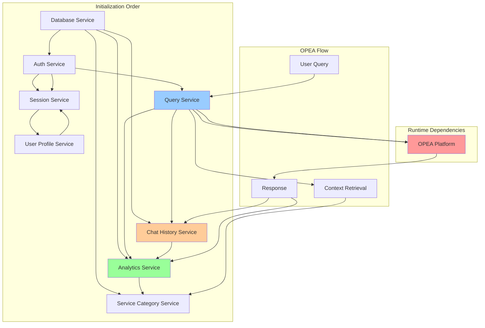
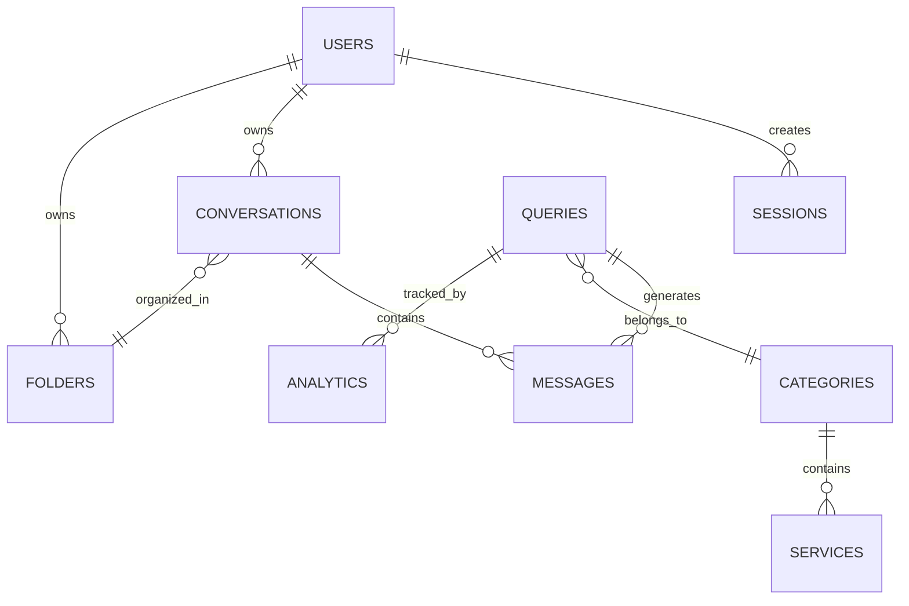
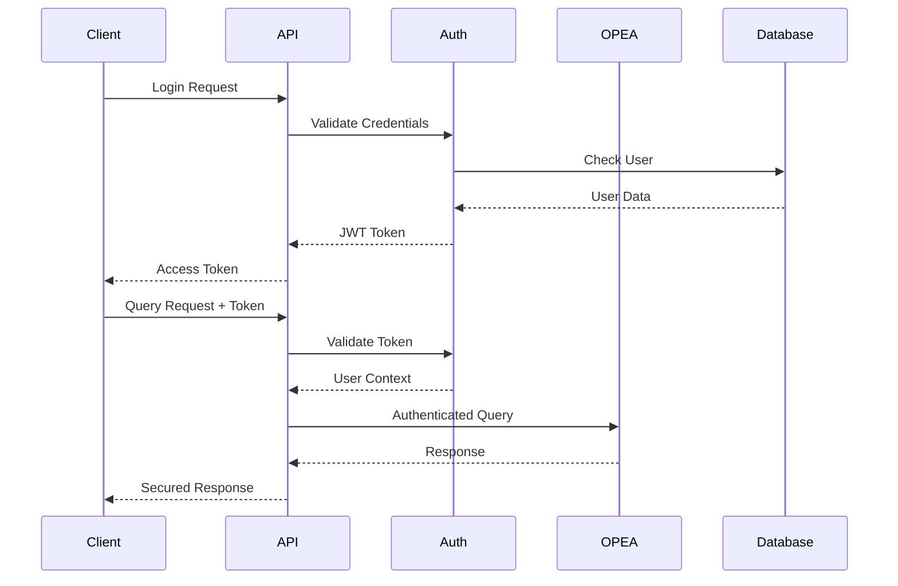

# GENIE.AI - RAG Chatbot Framework Backend

This repository contains the backend services that power the GENIE.AI RAG (Retrieval-Augmented Generation) chatbot framework. GENIE.AI is a comprehensive enterprise chatbot platform that leverages OPEA (Open Platform for Enterprise AI) for LLM hosting and access, providing intelligent conversational AI capabilities with advanced user management, analytics, and administrative tools.

## Table of Contents

- [Overview](#overview)
- [System Architecture](#system-architecture)
- [OPEA Integration](#opea-integration)
- [Service Architecture](#service-architecture)
- [Core Services](#core-services)
- [Service Dependencies](#service-dependencies)
- [Database Schema](#database-schema)
- [Security System](#security-system)
- [API Layer](#api-layer)
- [Setup and Configuration](#setup-and-configuration)
- [Development](#development)
- [Deployment](#deployment)
- [Security Considerations](#security-considerations)

## Overview

GENIE.AI is designed as a microservices-based RAG chatbot framework that provides:

- **RAG-Powered Conversations**: Intelligent responses using OPEA's LLM hosting platform
- **Knowledge Base Management**: Service categorization and retrieval for context-aware responses
- **Conversation Management**: Persistent chat history with folder organization and threading
- **Advanced Analytics**: Real-time monitoring of chatbot performance and user interactions
- **Multi-language Support**: Internationalized responses and content management
- **Enterprise Features**: User management, security scanning, and administrative dashboards

## System Architecture



## OPEA Integration

GENIE.AI leverages OPEA (Open Platform for Enterprise AI) as the core AI engine for LLM processing. OPEA provides a comprehensive platform for hosting and accessing Large Language Models.

### OPEA Architecture Integration



### OPEA Configuration

```yaml
# OPEA Service Configuration
OPEA_HOST: "e2e-109-198"  # OPEA server hostname
OPEA_PORT: "8888"         # OPEA service port
OPEA_ENDPOINT: "/v1/chatqna"  # ChatQNA endpoint
```

### OPEA Request Flow

1. **Query Processing**: User queries are received by the Query Service
2. **Context Retrieval**: Relevant knowledge is retrieved from the vector store
3. **Context Assembly**: Query and context are combined into a prompt
4. **OPEA Request**: POST request to OPEA's ChatQNA endpoint
5. **LLM Processing**: OPEA routes to appropriate LLM models
6. **Response Generation**: LLM generates contextual response
7. **Response Delivery**: Formatted response returned to client

## Service Architecture

### Service Types Classification

#### Singleton Services (Stateful)
**Pattern**: Single instance per application with internal state management
**Lifecycle**: Application-scoped, initialized once

| Service | Type | State Management | OPEA Integration |
|---------|------|------------------|------------------|
| **Query Service** | Singleton | Maintains connections to Analytics and ChatHistory | Direct OPEA API calls |
| **Analytics Service** | Singleton | Caches aggregated data, ServiceCategory reference | Tracks OPEA response metrics |
| **Chat History Service** | Singleton | Conversation state, analytics dependency | Stores OPEA responses |
| **Session Service** | Singleton | Active sessions, expiration timers | Session-based OPEA context |
| **User Profile Service** | Singleton | File upload state, session dependency | User-specific OPEA preferences |
| **Service Category Service** | Singleton | Translation cache, category hierarchy | Knowledge base for OPEA context |
| **Auth Service** | Singleton | Token validation state, session dependency | Secure OPEA access |

#### Utility Services (Stateless)
**Pattern**: Functional services with minimal internal state

| Service | Type | Configuration | OPEA Role |
|---------|------|---------------|-----------|
| **Email Service** | Stateless | SMTP configuration | Notification delivery |
| **Weather Service** | Stateless | API keys, location cache | External data augmentation |
| **Logs Service** | Stateless | File system paths | OPEA interaction logging |

#### Administrative Services (Hybrid)
**Pattern**: Combination of stateless operations with caching

| Service | Type | State Management | OPEA Monitoring |
|---------|------|------------------|-----------------|
| **Admin Dashboard Service** | Hybrid | Resource usage cache | OPEA performance metrics |
| **Security Scan Service** | Hybrid | Scan result cache | OPEA security analysis |
| **Database Operations Service** | Hybrid | Backup state | OPEA data management |

## Core Services

### Query Service
**File**: `query-service.js`
**Type**: Singleton Service
**OPEA Integration**: Primary interface to OPEA ChatQNA service

The Query Service is the core component handling RAG conversations:

- **OPEA Communication**: Direct integration with OPEA's ChatQNA endpoint
- **Context Management**: Assembles user queries with retrieved knowledge
- **Response Processing**: Handles OPEA responses and stores conversation history
- **Analytics Integration**: Records query metrics and response times

Key OPEA interactions:
```javascript
// OPEA API Call
const opeaUrl = `http://${opeaHost}:${opeaPort}/v1/chatqna`;
const opeaPayload = {
  messages: queryData.text,  // User query + context
  stream: false
};
const opeaResponse = await axios.post(opeaUrl, opeaPayload);
const responseContent = opeaResponse.data.choices[0].message.content;
```

Functions:
- `createQuery`: Creates query and calls OPEA for response
- `addFeedback`: Records user feedback on OPEA responses
- `setQueryCategory`: Categorizes queries for context retrieval
- `getSimilarQueries`: Finds related queries for context

### Analytics Service
**File**: `analytics-service.js`
**Type**: Singleton Service
**OPEA Integration**: Monitors OPEA performance and usage

Tracks and analyzes chatbot interactions:

- **OPEA Metrics**: Response times, success rates, token usage
- **Conversation Analytics**: User engagement, satisfaction scores
- **Performance Monitoring**: OPEA service health and availability
- **Usage Trends**: Query patterns and knowledge base effectiveness

Key functions:
- `recordQuery`: Records OPEA query attempts and results
- `recordFeedback`: Tracks user satisfaction with OPEA responses
- `getDashboardAnalytics`: OPEA performance dashboard data
- `getTimeSeriesData`: OPEA usage trends over time

### Chat History Service
**File**: `chat-history-service.js`
**Type**: Singleton Service
**OPEA Integration**: Manages conversation persistence

Manages persistent conversations and folder organization:

- **Conversation Threads**: Multi-turn conversations with OPEA
- **Message Linking**: Links OPEA responses to original queries
- **Folder Organization**: Hierarchical conversation management
- **Context Persistence**: Maintains conversation context for OPEA

Key functions:
- `createConversation`: Starts new conversation thread
- `addMessage`: Adds OPEA responses to conversations
- `linkQueryToConversation`: Links OPEA responses to queries
- `createConversationFromQuery`: Converts standalone queries to conversations

### Service Category Service
**File**: `service-category-service.js`
**Type**: Singleton Service
**OPEA Integration**: Knowledge base management for RAG

Manages the knowledge base structure for context retrieval:

- **Category Hierarchy**: Organizes knowledge for efficient retrieval
- **Multi-language Support**: Localized knowledge categories
- **Context Mapping**: Maps user queries to relevant knowledge areas
- **RAG Enhancement**: Provides structured context for OPEA queries

Key functions:
- `getAllCategoriesWithServices`: Retrieval knowledge structure
- `searchCategoriesAndServices`: Context-aware knowledge search
- `upsertCategories`: Manages knowledge base updates

### User Profile Service
**File**: `user-profile-service.js`
**Type**: Singleton Service
**OPEA Integration**: User-specific OPEA preferences

Manages user accounts and personalization:

- **Profile Management**: User information and preferences
- **OPEA Personalization**: User-specific conversation context
- **File Handling**: Document uploads for RAG context
- **Session Integration**: Links users to conversation sessions

### Session Service
**File**: `session-service.js`
**Type**: Singleton Service
**OPEA Integration**: Session-based conversation context

Manages user sessions and conversation state:

- **Session Persistence**: Maintains conversation context across interactions
- **OPEA Context**: Provides session-based context to OPEA
- **Expiration Management**: Handles session timeouts
- **Multi-device Support**: Cross-device conversation continuity

### Auth Service
**File**: `auth-service.js`
**Type**: Singleton Service
**OPEA Integration**: Secure access to OPEA services

Handles authentication and authorization:

- **JWT Management**: Token-based authentication
- **OPEA Security**: Secure access to OPEA endpoints
- **Password Management**: User credential handling
- **Email Verification**: Account verification workflows

## Service Dependencies



### Dependency Injection Pattern

Services use setter injection for loose coupling:

```javascript
// Analytics Service Dependencies
analyticsService.setServiceCategoryService(serviceCategoryService);

// Query Service Dependencies
queryService.setAnalyticsService(analyticsService);
queryService.setChatHistoryService(chatHistoryService);

// User Profile Service Dependencies
userProfileService.setSessionService(sessionService);

// Auth Service Dependencies
authService.setSessionService(sessionService);

// Chat History Service Dependencies
chatHistoryService.setAnalyticsService(analyticsService);
```

### OPEA Integration Dependencies

```javascript
// OPEA Configuration Dependencies
const opeaHost = process.env.OPEA_HOST || 'e2e-109-198';
const opeaPort = process.env.OPEA_PORT || '8888';
const opeaUrl = `http://${opeaHost}:${opeaPort}/v1/chatqna`;

// Service Dependencies for OPEA Context
queryService.setAnalyticsService(analyticsService);  // For metrics
queryService.setChatHistoryService(chatHistoryService);  // For conversation context
```

## Database Schema

The system uses ArangoDB, a multi-model database supporting documents and graphs:

### Core Collections

#### RAG-Specific Collections
- `queries`: User queries and OPEA responses
- `conversations`: Multi-turn conversation threads
- `messages`: Individual messages in conversations
- `queryMessages`: Links between queries and conversation messages

#### Knowledge Base Collections
- `serviceCategories`: Knowledge categories for RAG context
- `services`: Specific knowledge items within categories
- `categoryServices`: Relationships between categories and services
- `serviceCategoryTranslations`: Multi-language support
- `serviceTranslations`: Localized service descriptions

#### User Management Collections
- `users`: User profiles and authentication data
- `sessions`: Active user sessions
- `userSessions`: User-session relationships
- `userConversations`: User-conversation ownership

#### Conversation Organization
- `folders`: Conversation folder structure
- `folderConversations`: Folder-conversation relationships
- `userFolders`: User folder permissions

#### Analytics Collections
- `analytics`: Query and response metrics
- `events`: System events and user interactions

### Graph Relationships



## Security System

### Authentication Flow



### Security Features

#### Authentication & Authorization
- **JWT Tokens**: Stateless authentication with refresh tokens
- **Session Management**: Server-side session tracking
- **Role-Based Access**: User roles and permissions
- **OPEA Security**: Authenticated access to OPEA services

#### Security Monitoring
- **Real-time Scanning**: Continuous security threat detection
- **Log Analysis**: Automated log parsing for security events
- **Vulnerability Detection**: Pattern-based threat identification
- **OPEA Access Control**: Secure API access to OPEA endpoints

#### Data Protection
- **Password Encryption**: bcrypt password hashing
- **Token Security**: Secure token generation and validation
- **File Upload Security**: Validated file uploads
- **Database Security**: Parameterized queries and access controls

## API Layer

### Base Configuration

```javascript
// API Configuration (api.js)
const api = axios.create({
  baseURL: process.env.VUE_APP_API_URL || '/api',
  timeout: 30000,
  headers: {
    'Content-Type': 'application/json',
    'Accept': 'application/json'
  }
});
```

### OPEA Integration Endpoints

#### Query Processing
- `POST /api/queries` - Submit query to OPEA
- `GET /api/queries/:id` - Get query and OPEA response
- `POST /api/queries/:id/feedback` - Rate OPEA response

#### Conversation Management
- `GET /api/conversations` - List user conversations
- `POST /api/conversations` - Create new conversation thread
- `GET /api/conversations/:id` - Get conversation with OPEA responses
- `POST /api/conversations/:id/messages` - Add message to conversation

#### Knowledge Base
- `GET /api/categories` - Get knowledge categories for RAG
- `POST /api/categories/search` - Search knowledge base
- `GET /api/categories/:id/services` - Get category services

## Setup and Configuration

### Prerequisites

- Node.js 16+
- ArangoDB 3.9+
- OPEA Platform deployment
- Redis (optional, for caching)

### Environment Variables

```bash
# Database Configuration
ARANGO_URL=http://localhost:8529
ARANGO_DB=genie-ai
ARANGO_USERNAME=root
ARANGO_PASSWORD=password

# OPEA Configuration
OPEA_HOST=e2e-109-198
OPEA_PORT=8888
OPEA_ENDPOINT=/v1/chatqna

# Authentication
JWT_SECRET=your-secret-key
JWT_EXPIRES_IN=24h
SESSION_EXPIRATION_TIME=1800000

# Email Configuration
EMAIL_HOST=smtp.mailjet.com
EMAIL_PORT=587
EMAIL_USER=your-api-key
EMAIL_PASSWORD=your-secret-key
EMAIL_FROM=noreply@genie.ai

# File Upload
UPLOAD_DIR=/app/uploads

# Logging
LOG_LEVEL=info
LOG_DIR=/app/logs
```

### OPEA Platform Setup

1. **Deploy OPEA Platform**:
   ```bash
   # Follow OPEA documentation at https://opea.dev
   docker run -d --name opea-platform \
     -p 8888:8888 \
     opea/chatqna:latest
   ```

2. **Configure OPEA Connection**:
   ```bash
   export OPEA_HOST=your-opea-host
   export OPEA_PORT=8888
   ```

3. **Test OPEA Connection**:
   ```bash
   curl -X POST http://your-opea-host:8888/v1/chatqna \
     -H "Content-Type: application/json" \
     -d '{"messages": "Hello", "stream": false}'
   ```

### Installation

1. **Clone Repository**:
   ```bash
   git clone https://github.com/your-org/genie-ai-backend.git
   cd genie-ai-backend
   ```

2. **Install Dependencies**:
   ```bash
   npm install
   ```

3. **Initialize Database**:
   ```bash
   npm run init-db
   ```

4. **Start Services**:
   ```bash
   npm start
   ```

### Service Initialization Order

```javascript
// Proper initialization sequence
async function initializeServices() {
  // 1. Database connection
  await dbService.init();
  
  // 2. Core authentication
  await authService.init();
  
  // 3. Session management
  await sessionService.init();
  
  // 4. Knowledge base
  await serviceCategoryService.init();
  
  // 5. User management
  await userProfileService.init();
  
  // 6. Query processing (OPEA integration)
  await queryService.init();
  
  // 7. Analytics and monitoring
  await analyticsService.init();
  await chatHistoryService.init();
  
  // 8. Infrastructure services
  await adminDashboardService.init();
  await logsService.init();
  
  // 9. Set up dependencies
  authService.setSessionService(sessionService);
  userProfileService.setSessionService(sessionService);
  queryService.setAnalyticsService(analyticsService);
  queryService.setChatHistoryService(chatHistoryService);
  chatHistoryService.setAnalyticsService(analyticsService);
  analyticsService.setServiceCategoryService(serviceCategoryService);
}
```

## Development

### Adding New Services

1. **Create Service File**:
   ```javascript
   // new-service.js
   class NewService {
     constructor() {
       this.initialized = false;
     }
     
     async init() {
       // Initialize service
       this.initialized = true;
     }
   }
   
   module.exports = new NewService();
   ```

2. **Add OPEA Integration** (if needed):
   ```javascript
   async processWithOPEA(query) {
     const opeaUrl = `http://${process.env.OPEA_HOST}:${process.env.OPEA_PORT}/v1/chatqna`;
     const response = await axios.post(opeaUrl, {
       messages: query,
       stream: false
     });
     return response.data.choices[0].message.content;
   }
   ```

### Testing OPEA Integration

```javascript
// Test OPEA connectivity
async function testOPEAConnection() {
  try {
    const response = await axios.post(
      `http://${process.env.OPEA_HOST}:${process.env.OPEA_PORT}/v1/chatqna`,
      {
        messages: "Test query",
        stream: false
      }
    );
    console.log('OPEA connection successful');
    return true;
  } catch (error) {
    console.error('OPEA connection failed:', error.message);
    return false;
  }
}
```

### Running Tests

```bash
# Unit tests
npm test

# OPEA integration tests
npm run test:opea

# Full test suite
npm run test:all
```

## Deployment

### Docker Deployment

```dockerfile
# Dockerfile
FROM node:18-alpine

WORKDIR /app
COPY package*.json ./
RUN npm ci --only=production

COPY . .
EXPOSE 3000

CMD ["npm", "start"]
```

### Docker Compose with OPEA

```yaml
# docker-compose.yml
version: '3.8'

services:
  genie-ai-backend:
    build: .
    ports:
      - "3000:3000"
    environment:
      - OPEA_HOST=opea-platform
      - OPEA_PORT=8888
    depends_on:
      - arangodb
      - opea-platform

  opea-platform:
    image: opea/chatqna:latest
    ports:
      - "8888:8888"
    environment:
      - LLM_MODEL_ID=Intel/neural-chat-7b-v3-3
    volumes:
      - opea-models:/app/models

  arangodb:
    image: arangodb:3.9
    ports:
      - "8529:8529"
    environment:
      - ARANGO_ROOT_PASSWORD=password
    volumes:
      - arangodb-data:/var/lib/arangodb3

volumes:
  arangodb-data:
  opea-models:
```

### Production Deployment

```bash
# Build and deploy
docker-compose -f docker-compose.prod.yml up -d

# Scale services
docker-compose scale genie-ai-backend=3

# Monitor OPEA health
curl http://your-domain:8888/health
```

## Security Considerations

### OPEA Security
- **API Authentication**: Secure access to OPEA endpoints
- **Input Validation**: Sanitize queries before sending to OPEA
- **Response Filtering**: Validate OPEA responses before storage
- **Rate Limiting**: Prevent OPEA service abuse

### Data Security
- **Conversation Privacy**: Encrypt sensitive conversation data
- **User Data Protection**: GDPR-compliant data handling
- **Audit Logging**: Track all OPEA interactions
- **Secure Storage**: Encrypted file uploads and database storage

### Infrastructure Security
- **Network Security**: VPC isolation for OPEA services
- **Access Controls**: Role-based access to administrative functions
- **Monitoring**: Real-time security threat detection
- **Backup Security**: Encrypted database and file backups

### Compliance
- **Data Retention**: Configurable conversation and query retention
- **Privacy Controls**: User data deletion and export capabilities
- **Security Scanning**: Automated vulnerability detection
- **Incident Response**: Security event alerting and response procedures

---

**GENIE.AI** - Powered by OPEA (Open Platform for Enterprise AI)  
For more information about OPEA, visit: https://opea.dev