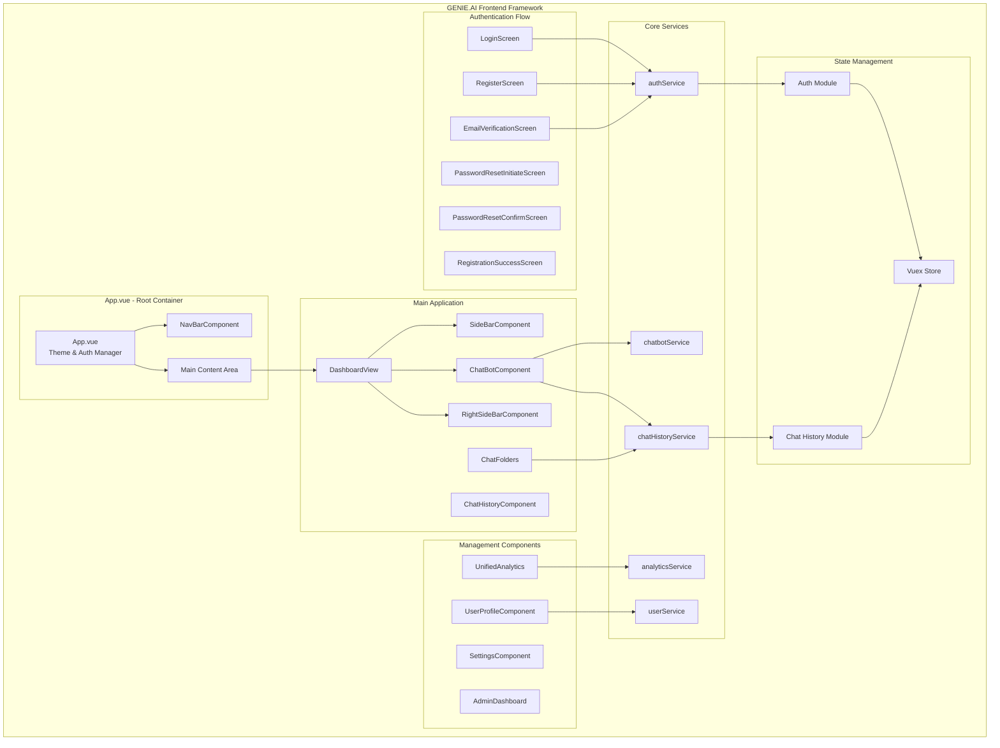
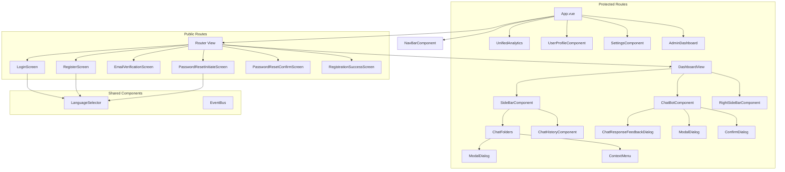
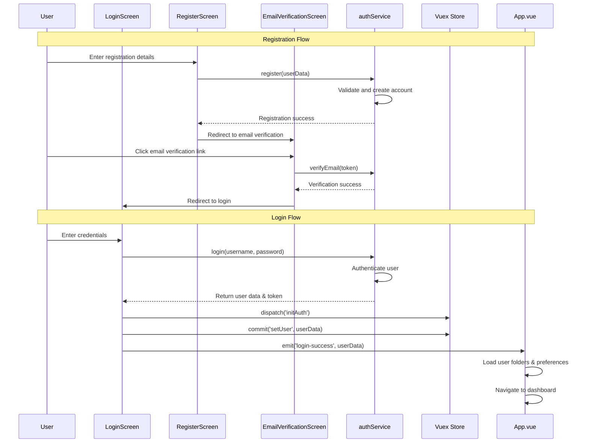
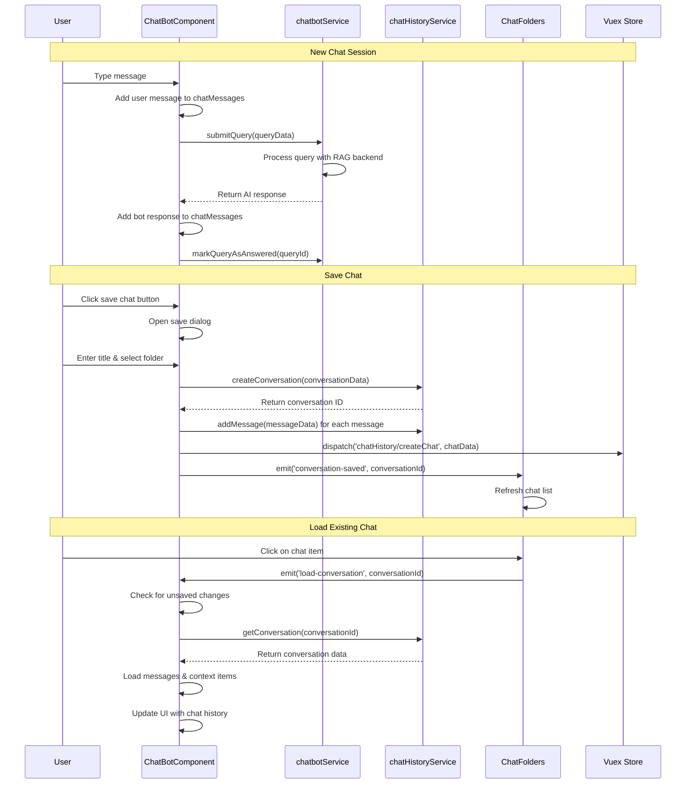
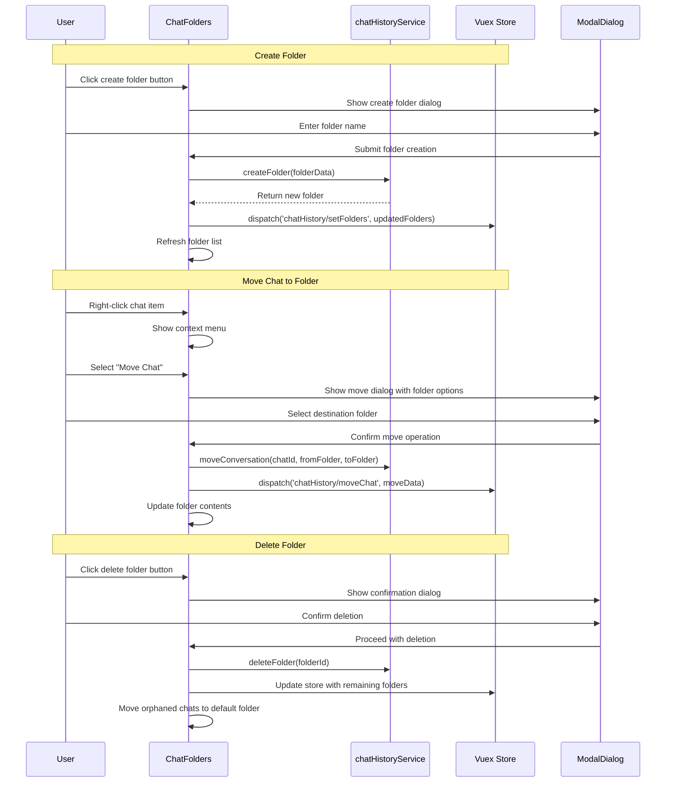
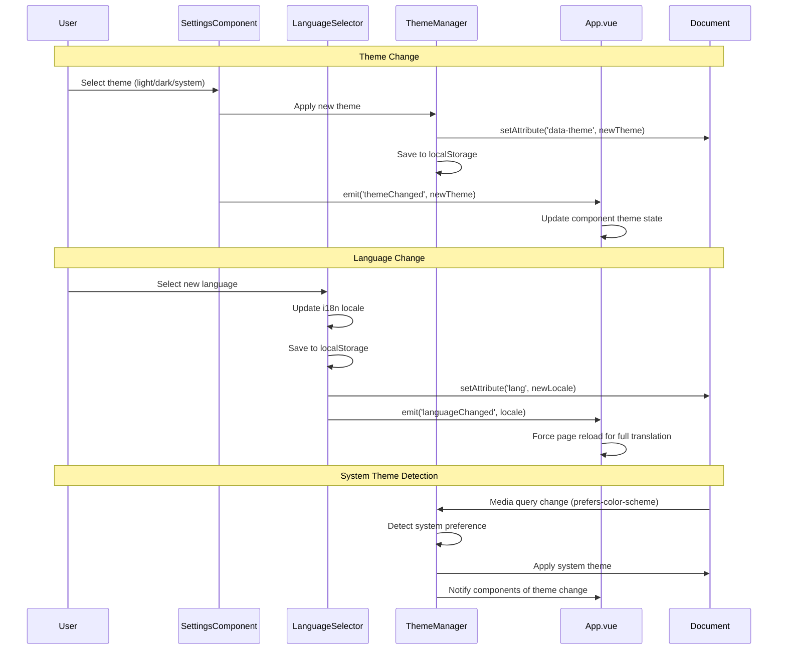

# GENIE.AI Frontend Framework

## Project Charter

GENIE.AI is a comprehensive RAG (Retrieval-Augmented Generation) chatbot framework designed to provide intelligent, context-aware conversational experiences for any domain or use case. The frontend is built with Vue.js 3 and provides a modern, accessible, and multilingual interface that can be customized for various industries and applications - from customer service and healthcare to education and e-commerce.

### Mission Statement
To democratize access to intelligent conversational AI through a flexible, configurable framework that enables organizations to create context-aware chatbots that understand domain-specific knowledge, speak multiple languages, and provide accurate, helpful responses tailored to their specific use cases.

### Key Features
- **Domain Agnostic**: Configurable for any industry or use case
- **RAG Integration**: Seamless retrieval-augmented generation capabilities
- **Multilingual Support**: Full internationalization system for global deployment
- **Responsive Design**: Mobile-first approach with adaptive layouts
- **Real-time Analytics**: Comprehensive usage tracking and insights
- **User Profile Management**: Flexible user data collection system
- **Chat History Organization**: Folder-based conversation management
- **Theme System**: Light/dark mode with customizable branding
- **Configuration-Driven**: JSON-based customization without code changes
- **Accessibility**: WCAG compliant design patterns

### Use Cases
- **Customer Service**: Automated support with knowledge base integration
- **Healthcare**: Patient inquiries and medical information assistance
- **Education**: Interactive learning and student support systems
- **E-commerce**: Product recommendations and shopping assistance
- **Government Services**: Citizen service portals and information access
- **HR & Employee Support**: Internal knowledge base and policy guidance
- **Financial Services**: Account inquiries and financial advice
- **Real Estate**: Property search and market information

## Project Structure

```
src/
├── main.js                 # Application entry point with config loading
├── App.vue                 # Root component
├── router.js               # Vue Router configuration
├── i18n.js                 # Internationalization setup
├── eventBus.js             # Custom event bus implementation
├── store/
│   ├── index.js            # Vuex store configuration
│   ├── chatHistoryStore.js # Chat history state management
│   └── modules/
│       └── auth.js         # Authentication module
├── components/             # Vue components
├── views/                  # Page-level components
├── services/               # API and business logic
├── utils/                  # Utility functions
└── assets/                 # Static assets
```

## Configuration System

### GENIE.AI Framework Configuration

The application uses a dynamic configuration system that loads from `/config/genie-ai-config.json`, allowing complete customization without code changes. The configuration follows a JSON Schema for validation and type safety.

#### Complete Configuration Schema

```json
{
  "$schema": "http://json-schema.org/draft-07/schema#",
  "app": {
    "title": "Ghișeul Unic AI",
    "icon": {
      "type": "file",
      "value": "/config/huduma-icon.svg"
    }
  },
  "theme": {
    "primaryColor": "#7A2A6A",
    "secondaryColor": "#4D143F", 
    "backgroundColor": "#EAD9E5",
    "textColor": "#1C1519",
    "navbar": {
      "gradientStart": "#6B245C",
      "gradientEnd": "#3D0F31",
      "textColor": "#F0E7EC"
    }
  },
  "features": {
    "chat": {
      "welcomeMessage": "Welcome to Ghișeul Unic AI, your public service assistant!",
      "botName": "Ghișeul Unic AI",
      "quickHelp": {
        "buttons": [
          {
            "id": "just-chat",
            "title": "quickhelp.justChat",
            "icon": {
              "type": "file",
              "value": "/config/quickhelp/just-chat.svg"
            },
            "category": null,
            "prompt": "quickhelp.justChatPrompt",
            "styles": {
              "backgroundColor": "#EAD9E5",
              "hoverColor": "#D8C1D3",
              "outlineColor": "#B69CB1"
            }
          }
          // Additional buttons...
        ]
      }
    }
  },
  "custom": {
    // Custom domain-specific configurations
  }
}
```

#### Configuration Structure

**App Settings**:
- `title`: Application name displayed in the UI
- `icon`: SVG icon configuration (file path or inline SVG)

**Theme Configuration**:
- `primaryColor`: Main brand color for buttons and accents
- `secondaryColor`: Secondary color for highlights
- `backgroundColor`: Main content area background
- `textColor`: Primary text color
- `navbar`: Navigation bar specific styling with gradient support

**Chat Features**:
- `welcomeMessage`: Custom greeting message
- `botName`: Assistant name for personalization
- `quickHelp.buttons`: Configurable quick action buttons

**Quick Help Button Structure**:
```json
{
  "id": "unique-identifier",
  "title": "i18n.translationKey",
  "icon": {
    "type": "file|inline",
    "value": "/path/to/icon.svg"
  },
  "category": "service-category-id",
  "prompt": "i18n.promptKey", 
  "styles": {
    "backgroundColor": "#color",
    "hoverColor": "#color",
    "outlineColor": "#color"
  }
}
```

#### Domain-Specific Examples

**E-commerce Configuration**:
```json
{
  "app": {
    "title": "ShopBot Assistant",
    "icon": {
      "type": "file", 
      "value": "/config/shop-icon.svg"
    }
  },
  "theme": {
    "primaryColor": "#FF6B35",
    "secondaryColor": "#E55A31",
    "backgroundColor": "#FFF8F6",
    "textColor": "#2D1B17"
  },
  "features": {
    "chat": {
      "welcomeMessage": "Hi! I'm here to help you shop smart.",
      "botName": "ShopBot",
      "quickHelp": {
        "buttons": [
          {
            "id": "find-products",
            "title": "quickhelp.findProducts",
            "category": "search",
            "prompt": "quickhelp.findProductsPrompt"
          }
        ]
      }
    }
  }
}
```

**Healthcare Configuration**:
```json
{
  "app": {
    "title": "HealthCare Assistant",
    "icon": {
      "type": "file",
      "value": "/config/health-icon.svg"
    }
  },
  "theme": {
    "primaryColor": "#2E8B57",
    "secondaryColor": "#228B22",
    "backgroundColor": "#F0FFF0",
    "textColor": "#2F4F4F"
  },
  "features": {
    "chat": {
      "welcomeMessage": "Hello! I'm here to help with your healthcare needs.",
      "botName": "HealthBot",
      "quickHelp": {
        "buttons": [
          {
            "id": "book-appointment",
            "title": "quickhelp.bookAppointment",
            "category": "appointments",
            "prompt": "quickhelp.bookAppointmentPrompt"
          }
        ]
      }
    }
  }
}
```

### Environment Variables

Ensure the following environment variable is set:

```bash
VUE_APP_API_URL=http://localhost:3000/api
```

## Core Systems

### 1. Internationalization (i18n)

The application supports three languages with comprehensive translation coverage:

#### Supported Languages
- **English (en)**: Default language
- **French (fr)**: Complete translation set
- **Romanian (ro)**: Complete translation set

#### Key Translation Categories
- Navigation and UI elements
- Configurable service categories (customizable per domain)
- User profile sections and fields (adaptable to use case)
- Analytics and reporting
- System status and notifications
- Chat interface and interactions
- Domain-specific terminology and content

#### Language Detection Priority
1. Saved user preference (localStorage)
2. Browser language detection
3. Default to English

#### Usage Example
```javascript
// In components
this.$t('nav.menu')
this.$t('userProfile.tabs.tab1')

// Programmatic locale switching
this.$setLocale('fr')
```

### 2. Theme System

Advanced theming system with CSS custom properties and dynamic switching:

#### Theme Modes
- **Light Theme**: Default bright interface
- **Dark Theme**: Dark mode for low-light environments
- **System Theme**: Follows OS preference

#### CSS Architecture
- `theme-variables.css`: CSS custom properties
- `theme-components.css`: Component-specific theming
- Dynamic CSS variable updates based on configuration

#### Implementation
```javascript
// Theme detection and application
const themeInfo = themeManager.getThemeInfo();
document.documentElement.setAttribute('data-theme', theme);
```

### 3. State Management (Vuex)

#### Store Modules

**Chat History Store (`chatHistoryStore.js`)**
- Folder-based chat organization
- Real-time chat synchronization
- Persistent storage with localStorage backup

**Authentication Module (`auth.js`)**
- User session management
- Token-based authentication
- Automatic session restoration

#### Key State Features
- Automatic localStorage persistence
- Module namespacing
- Reactive updates across components

### 4. Routing System

#### Route Structure
```javascript
const routes = [
  // Public routes
  { path: '/login', component: LoginScreen },
  { path: '/register', component: RegisterScreen },
  { path: '/verify-email/:token', component: EmailVerificationScreen },
  
  // Protected routes
  { path: '/dashboard', component: DashboardView, meta: { requiresAuth: true } },
  { path: '/analytics', component: UnifiedAnalytics, meta: { requiresAuth: true } },
  { path: '/profile', component: UserProfileComponent, meta: { requiresAuth: true } }
]
```

#### Authentication Guards
- Automatic authentication state checking
- Redirect handling for unauthenticated users
- Route protection based on meta properties

### 5. Event System

Custom event bus implementation for component communication:

```javascript
// Event emission
eventBus.$emit('languageChanged', { language: 'fr' })

// Event listening
eventBus.$on('chatUpdated', (chatData) => {
  // Handle chat update
})
```

## Architecture Overview

### Application Structure Diagram



### Component Hierarchy



## Component Architecture

### User Authentication Flow



### Chat Interaction Flow



### Folder Management Flow



### Theme and Localization Flow



The application organizes services into configurable categories that can be customized for any domain:

**Example: Government Services (Default Configuration)**
1. **Identity & Civil Registration**
2. **Healthcare & Social Services**
3. **Education & Learning**
4. **Employment & Labor Services**
5. **Taxes & Revenue**
6. **Public Safety & Justice**
7. **Transportation & Mobility**
8. **Housing & Urban Development**
9. **Utilities & Environment**
10. **Business & Trade**
11. **Social Security & Pensions**
12. **Community & Civic Engagement**

**Example: E-commerce Configuration**
1. **Product Catalog & Search**
2. **Order Management**
3. **Payment & Billing**
4. **Shipping & Delivery**
5. **Returns & Exchanges**
6. **Customer Account**
7. **Technical Support**
8. **Product Reviews & Recommendations**

**Example: Healthcare Configuration**
1. **Appointment Scheduling**
2. **Medical Records & History**
3. **Insurance & Billing**
4. **Prescription Management**
5. **Lab Results & Reports**
6. **Provider Information**
7. **Health Education & Resources**
8. **Emergency & Urgent Care**

### 2. User Profile System

Flexible profile system that adapts to different domains and use cases:

**Configurable Profile Sections:**
- **Basic Information**: Core user data relevant to your domain
- **Preferences**: User settings and customization options
- **History & Activity**: Past interactions and engagement data
- **Documents & Verification**: Domain-specific document management
- **Custom Fields**: Industry-specific data collection

**Example Configurations:**

**E-commerce Profile:**
- Personal details and contact information
- Shipping addresses and preferences  
- Payment methods and billing information
- Order history and purchase patterns
- Product preferences and wishlist
- Communication preferences

**Healthcare Profile:**
- Patient demographics and emergency contacts
- Medical history and current conditions
- Insurance information and coverage details
- Provider preferences and appointment history
- Medication lists and allergies
- Health goals and monitoring data

**Government Services Profile (Default):**
- Personal identification data
- Civil registration documents
- Address and residency information
- Employment and financial data
- Service history and preferences

### 3. Analytics Dashboard

Configurable analytics system that adapts to different business needs:

**Core Metrics (Universal):**
- Usage statistics and trends
- User satisfaction and feedback
- Chat completion rates
- Response accuracy metrics
- System performance indicators

**Domain-Specific Analytics:**

**E-commerce:**
- Product inquiry patterns
- Conversion tracking from chat to purchase  
- Cart abandonment recovery
- Customer lifetime value impact

**Healthcare:**
- Appointment booking success rates
- Common health inquiry categories
- Patient satisfaction with AI responses
- Provider referral patterns

**Customer Service:**
- Issue resolution rates
- Escalation to human agents
- Cost savings through automation
- Customer effort scores

**Exportable Reports:**
- CSV/Excel data exports
- Customizable date ranges
- Filtered analytics by category
- Performance benchmarking

## Mobile Responsiveness

### Viewport Handling
- Dynamic viewport height calculation
- iOS Safari toolbar accommodation
- Android keyboard detection and adjustment

### CSS Breakpoints
```css
/* Mobile-first responsive design */
--mobile: 768px
--tablet: 1024px
--desktop: 1200px
```

### Touch Interactions
- Touch-friendly button sizing
- Swipe gestures for navigation
- Optimized input handling

## Quick Start for New Domains

### 1. Configuration Setup
```bash
# Clone the repository
git clone <repository-url>
cd genie-ai-frontend

# Install dependencies
npm install

# Create your configuration file
cp /public/config/genie-ai-config.example.json /public/config/genie-ai-config.json

# Customize for your domain
nano /public/config/genie-ai-config.json
```

### 2. Docker Quick Start
```bash
# To deploy the full stack (frontend and backend) using Docker Compose
# Ensure docker-compose.yaml is in the parent directory containing gov-chat-frontend and gov-chat-backend

cd ..
docker-compose build
docker-compose up -d

# Access the application
open http://localhost:8090
```

### 3. Configuration Customization Steps

**Step 1: Basic Branding**
```json
{
  "app": {
    "title": "Your Assistant Name",
    "icon": {
      "type": "file",
      "value": "/config/your-logo.svg"
    }
  }
}
```

**Step 2: Theme Customization**
```json
{
  "theme": {
    "primaryColor": "#YOUR_BRAND_COLOR",
    "secondaryColor": "#YOUR_SECONDARY_COLOR",
    "backgroundColor": "#YOUR_BG_COLOR",
    "textColor": "#YOUR_TEXT_COLOR",
    "navbar": {
      "gradientStart": "#NAVBAR_START_COLOR",
      "gradientEnd": "#NAVBAR_END_COLOR", 
      "textColor": "#NAVBAR_TEXT_COLOR"
    }
  }
}
```

**Step 3: Quick Help Buttons**
```json
{
  "features": {
    "chat": {
      "quickHelp": {
        "buttons": [
          {
            "id": "your-action",
            "title": "quickhelp.yourAction",
            "icon": {
              "type": "file",
              "value": "/config/quickhelp/your-icon.svg"
            },
            "category": "your-category",
            "prompt": "quickhelp.yourActionPrompt",
            "styles": {
              "backgroundColor": "#BUTTON_BG",
              "hoverColor": "#BUTTON_HOVER", 
              "outlineColor": "#BUTTON_OUTLINE"
            }
          }
        ]
      }
    }
  }
}
```

**Step 4: Add Translations**
Update `src/i18n.js` with your domain-specific translations:
```javascript
export const messages = {
  en: {
    quickhelp: {
      yourAction: "Your Action Label",
      yourActionPrompt: "Prompt to send when clicked"
    }
  }
}
```

**Step 5: Add Custom Assets**
```bash
# Add your icons and assets
mkdir -p public/config/quickhelp
# Copy your SVG icons to public/config/quickhelp/
# Copy your main logo to public/config/
```

### 4. Environment Configuration
```bash
# Create .env file for development
VUE_APP_API_URL=https://your-backend-api.com/api
VUE_APP_VERSION=1.0.0
VUE_APP_ENVIRONMENT=development

# Production environment variables
VUE_APP_API_URL=https://api.your-domain.com
VUE_APP_VERSION=1.0.0
VUE_APP_ENVIRONMENT=production
```

### 5. Build and Deploy
```bash
# Development (frontend local)
npm run serve

# Production build (frontend only)
npm run build

# Full stack deployment with Docker Compose
docker-compose up -d --build

# Access the frontend at http://localhost:8090
# The backend is available at http://localhost:3000

# Required Configurations
# Update the docker-compose.yaml file with the following environment variables.
# For sensitive values, use a .env file or set them directly.

# Frontend environment variables (under services.frontend.environment):
- NODE_ENV=production
- VUE_APP_API_URL=https://e2e-82-109.ssdcloudindia.net:443/api  # Or your backend API URL

# Backend environment variables (under services.backend.environment):
- NODE_ENV=production
- PORT=3000
- API_PREFIX=/api
- UPLOAD_DIR=./Uploads
- MAX_FILE_SIZE=5242880
- SESSION_SECRET=${SESSION_SECRET:-default-session-secret}  # Replace with a secure secret
- SESSION_EXPIRATION_TIME=1800000
- CORS_ORIGIN=https://e2e-82-109.ssdcloudindia.net/  # Set to your frontend URL
- EMAIL_HOST=in-V3.mailjet.com
- EMAIL_PORT=587
- EMAIL_SECURE=false
- EMAIL_USER=187ad3288090609e6e282b07f359acd4  # Replace with your email user
- EMAIL_PASSWORD=6615d81ddd46faab7e69eb6710ac364a  # Replace with your email password
- EMAIL_FROM=fordendk@gmail.com  # Replace with your from email
- APP_NAME=Ghișeul Unic AI
- FRONTEND_URL=https://e2e-82-109.ssdcloudindia.net/  # Set to your frontend URL
- ARANGO_URL=http://arango-vector-db:8529
- ARANGO_DB=node-services
- ARANGO_USER=root
- ARANGO_PASSWORD=${ARANGO_PASSWORD:-default-arango-password}  # Replace with secure password
- BACKUP_DIR=./database_backups
- MAX_BACKUPS=5
- BACKUP_FORMAT=json
- JWT_SECRET=${JWT_SECRET:-default-jwt-secret}  # Replace with a secure secret
- JWT_EXPIRES_IN=24h
- LOG_LEVEL=debug
- OPEA_HOST=e2e-109-198
- OPEA_PORT=8888
- CONTEXT_OPTION=single-message

# The backend also loads additional variables from ./gov-chat-backend/.env
```

### RAG Integration Points

The frontend is designed to work seamlessly with RAG backend systems:

- **Knowledge Base Queries**: Structured query formatting for RAG retrieval
- **Context Management**: Conversation context preservation for enhanced responses
- **Document References**: Support for cited sources and reference materials
- **Feedback Integration**: User feedback collection for RAG model improvement
- **Real-time Streaming**: Support for streaming responses from RAG systems

#### Backend API Integration

The application connects to the RAG backend through configurable API endpoints:

```javascript
// Environment-based API configuration
const API_BASE_URL = process.env.VUE_APP_API_URL || 'http://localhost:3000/api'

// Service integration example
class ChatbotService {
  async submitQuery(queryData) {
    const response = await fetch(`${API_BASE_URL}/chat/query`, {
      method: 'POST',
      headers: {
        'Content-Type': 'application/json',
        'Authorization': `Bearer ${userToken}`
      },
      body: JSON.stringify({
        userId: queryData.userId,
        sessionId: queryData.sessionId,
        text: queryData.text,
        categoryId: queryData.categoryId,
        serviceId: queryData.serviceId,
        context: queryData.context
      })
    })
    
    return response.json()
  }
}
```

#### Docker Environment Variables

The Docker Compose configuration supports environment-specific API endpoints for the frontend. Update the docker-compose.yaml under services.frontend.environment:

- VUE_APP_API_URL=https://your-api-url.com/api

Examples for different environments (modify in docker-compose.yaml):

# Development
- VUE_APP_API_URL=https://dev-api.example.com/api

# Staging  
- VUE_APP_API_URL=https://staging-api.example.com/api

# Production
- VUE_APP_API_URL=https://api.example.com

## Development Setup

### Installation
```bash
npm install
```

### Development Server
```bash
npm run serve
```

### Production Build
```bash
npm run build
```

### Configuration Requirements
1. Create `/public/config/genie-ai-config.json`
2. Set environment variables
3. Configure API endpoints

## Dependencies

### Core Framework
- **Vue.js 3.2+**: Progressive JavaScript framework
- **Vue Router 4**: Client-side routing
- **Vuex 4**: State management
- **Vue i18n 9**: Internationalization

### UI and Visualization
- **ApexCharts**: Interactive charts and graphs
- **Chart.js**: Additional charting capabilities
- **ECharts**: Advanced data visualization
- **FontAwesome**: Icon library

### Utilities
- **Axios**: HTTP client for API communication
- **DOMPurify**: XSS protection for user content
- **jsPDF**: PDF generation capabilities
- **Marked**: Markdown parsing
- **D3.js**: Data manipulation and visualization

### Development