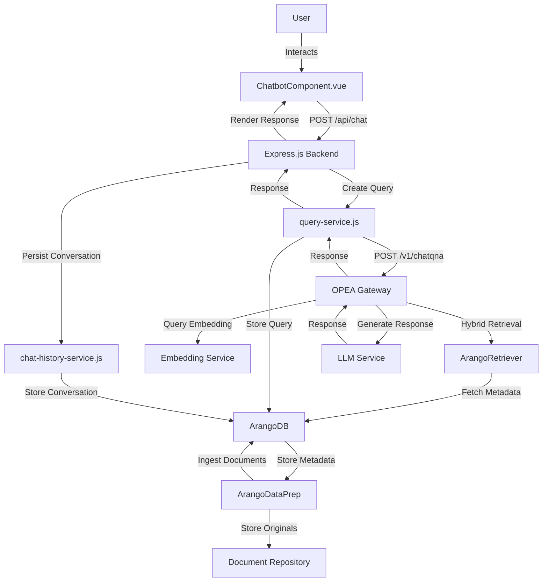
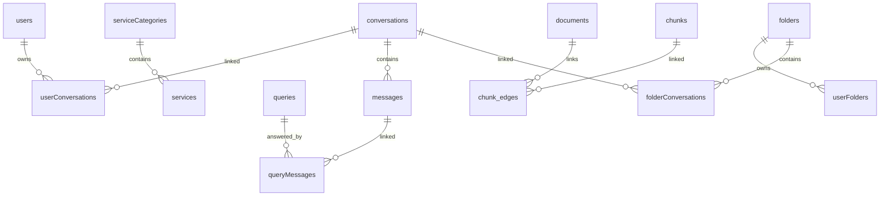

# GENIE.AI OPEA Integration Guide (Updated with Category/Service Labels and Document Repository)

This comprehensive guide outlines the integration of the OPEA ChatQnA service with the GENIE.AI application, enabling context-aware chatbot conversations with a two-level tree of category and service labels. Users select one primary category label and multiple service labels in the frontend, which are included in the request as data labels (not tied to ArangoDB IDs). The guide covers the Vue.js frontend (`ChatbotComponent.vue`), Node.js backend (`chat-history-service.js`, `query-service.js`), ArangoDB persistence, and modifications to the OPEA megaservice (`ArangoDataPrep`, `ArangoRetriever`, Gateway) to handle `context` with `categoryLabel` and `serviceLabels`. A separate document repository service is introduced for storing original documents, and the OPEA response includes multiple document references with their associated labels. The frontend does not yet render document links (planned for the next version). The guide aligns with the Docker services running on `e2e-109-198`.

---

## 1. Overview

### Objective
The integration enables context-aware conversations via a Vue.js chatbot, leveraging OPEA's RAG pipeline. Key features include:
- A two-level tree in the frontend for selecting one primary `categoryLabel` and multiple `serviceLabels`.
- Proxying queries to OPEA's ChatQnA API (`http://e2e-109-198:8888/v1/chatqna`) with `categoryLabel` and `serviceLabels` as data labels.
- Storing original documents in a separate document repository service, accessed by **ArangoDataPrep**.
- Storing `categoryLabel` and `serviceLabels` in ArangoDB graph nodes via **ArangoDataPrep**.
- Filtering retrieved documents by labels in **ArangoRetriever**'s hybrid search.
- Returning multiple document references with associated labels in the OPEA response.
- Persisting conversations in ArangoDB and displaying responses (without document links) in the frontend.

### Architecture
The system comprises:
- **Frontend**: `ChatbotComponent.vue` captures user input, including label selections, and displays conversations.
- **Backend**:
  - `query-service.js`: Creates queries, communicates with OPEA, and links responses to conversations.
  - `chat-history-service.js`: Manages conversation persistence in ArangoDB.
- **Database**: ArangoDB stores `serviceCategories`, `services`, `conversations`, `messages`, `queries`, `chunks`, `chunk_edges`.
- **Document Repository Service**: Stores original documents, accessed by **ArangoDataPrep**.
- **OPEA Megaservice**:
  - **Gateway Service** (`chatqna-xeon-backend-server`): Routes queries.
  - **Embedding Service** (`tei-embedding-serving`, `embedding`): Generates vectors.
  - **ArangoDataPrep** (`dataprep-arango-server`): Chunks documents, stores metadata in ArangoDB, and originals in the repository.
  - **ArangoRetriever** (`retriever-arango-server`): Performs hybrid retrieval with label filtering.
  - **Reranker** (`reranker`, `tei-reranker-serving`): Ranks documents.
  - **LLM Service** (`llm-textgen`): Generates responses.
  - **Translation Service** (`llm-translation`): Handles multilingual responses.
  - **Guardrail Service** (`llm-guardrail`): Ensures response safety.

### Diagram: System Architecture



### Docker Services
OPEA services on `e2e-109-198`:

| Service                     | Image                                              | Port Mapping          | Description                          |
|-----------------------------|----------------------------------------------------|-----------------------|--------------------------------------|
| `chatqna-xeon-nginx-server` | `opea/nginx:latest`                                | `0.0.0.0:80->80/tcp`  | Nginx proxy                          |
| `chatqna-xeon-ui-server`    | `opea/chatqna-ui:latest`                           | `0.0.0.0:5173->5173/tcp` | OPEA UI (not used)               |
| `chatqna-xeon-backend-server` | `opea/chatqna:latest`                            | `0.0.0.0:8888->8888/tcp` | ChatQnA Gateway                   |
| `retriever-arango-server`   | `opea/retriever:latest`                            | `0.0.0.0:7025->7025/tcp` | ArangoRetriever                   |
| `dataprep-arango-server`    | `opea/dataprep:latest`                             | `0.0.0.0:6007->5000/tcp` | ArangoDataPrep                    |
| `tei-embedding-serving`     | `ghcr.io/huggingface/text-embeddings-inference`    | `0.0.0.0:7000->80/tcp` | Embedding service                 |
| `reranker`                  | `opea-reranker`                                    | `0.0.0.0:6100->8000/tcp` | Reranking service                 |
| `llm-translation`           | `opea-translation`                                 | `0.0.0.0:9030->9030/tcp` | Translation service               |
| `tei-reranker-serving`      | `ghcr.io/huggingface/text-embeddings-inference`    | `0.0.0.0:7100->80/tcp` | Reranker embeddings               |
| `llm-guardrail`             | `opea-guardrail`                                   | `0.0.0.0:9090->9090/tcp` | Guardrail service                 |
| `llm-textgen`               | `opea-textgen`                                     | `0.0.0.0:9000->9000/tcp` | LLM service                       |
| `embedding`                 | `opea-embedding`                                   | `0.0.0.0:6000->6000/tcp` | Additional embedding service      |

---

## 2. Prerequisites

### Backend Setup
- **Node.js Environment**: Node.js with `arangojs`, `uuid`, `dotenv`, `axios`, `express`.
- **ArangoDB**: Collections:
  - `serviceCategories`: Stores categories (e.g., `{ _key: "cat1", nameEN: "Identity & Civil Registration" }`).
  - `services`: Stores services (e.g., `{ _key: "srv1", categoryKey: "cat1", nameEN: "Birth Registration" }`).
  - `conversations`, `messages`, `queries`, `chunks`, `chunk_edges`.
- **Environment Variables**:
  ```bash
  export ARANGO_URL=http://localhost:8529
  export ARANGO_DATABASE=genie
  export ARANGO_USERNAME=root
  export ARANGO_PASSWORD=test
  export VUE_APP_API_URL=http://localhost:3000/api
  export OPEA_API_URL=http://e2e-109-198:8888/v1/chatqna
  export HUGGINGFACEHUB_API_TOKEN=your_huggingface_token
  export DOC_REPO_URL=http://e2e-109-198:8080
  ```

### Frontend Setup
- **Vue.js Project**: Vue 3 with `axios` and Vuetify for the tree UI.
- **API Configuration**: Set `VUE_APP_API_URL` in `.env`.

### Document Repository Service
- **Setup**: A separate service (e.g., FastAPI) running on `http://e2e-109-198:8080` for storing original documents.
- **API Example**:
  ```bash
  curl -X POST "http://e2e-109-198:8080/documents" \
    -H "Content-Type: multipart/form-data" \
    -F "file=@./civil_registration.pdf"
  ```
  Response:
  ```json
  { "document_id": "doc124", "url": "http://e2e-109-198:8080/documents/doc124" }
  ```

### OPEA Setup
- **Running Services**: Verify Docker containers.
- **Test OPEA API**:
  ```bash
  curl -X POST "http://e2e-109-198:8888/v1/chatqna" \
    -H "Content-Type: application/json" \
    -d '{"messages": [{"role": "user", "content": "Test query"}]}'
  ```
- **Test ArangoDataPrep**:
  ```bash
  curl -X POST "http://e2e-109-198:6007/v1/dataprep/ingest" \
    -H "Content-Type: multipart/form-data" \
    -F "file=@./document.pdf" \
    -F "categoryLabel=Identity & Civil Registration" \
    -F "serviceLabels=[\"Birth Registration\",\"Marriage Registration\"]"
  ```
- **Test ArangoRetriever**:
  ```bash
  curl -X POST "http://e2e-109-198:7025/retriever/search" \
    -H "Content-Type: application/json" \
    -d '{"query": "test", "query_vector": [0.1, 0.2, ...], "context": {"categoryLabel": "Identity & Civil Registration", "serviceLabels": ["Birth Registration"]}}'
  ```

### Data Preparation
- **Populate Categories/Services**:
  ```aql
  INSERT { _key: "cat1", nameEN: "Identity & Civil Registration" } INTO serviceCategories;
  INSERT { _key: "cat2", nameEN: "Healthcare & Social Services" } INTO serviceCategories;
  INSERT { _key: "srv1", categoryKey: "cat1", nameEN: "Birth Registration" } INTO services;
  INSERT { _key: "srv2", categoryKey: "cat1", nameEN: "Marriage Registration" } INTO services;
  INSERT { _key: "srv3", categoryKey: "cat2", nameEN: "Medical Records" } INTO services;
  ```
- **Ingest Documents**:
  ```bash
  curl -X POST "http://e2e-109-198:6007/v1/dataprep/ingest" \
    -H "Content-Type: multipart/form-data" \
    -F "file=@./civil_registration.pdf" \
    -F "categoryLabel=Identity & Civil Registration" \
    -F "serviceLabels=[\"Birth Registration\"]"
  ```
- **Disable Schema Validation**:
  ```aql
  db.serviceCategories.properties({ schema: null });
  db.services.properties({ schema: null });
  db.conversations.properties({ schema: null });
  db.messages.properties({ schema: null });
  db.queries.properties({ schema: null });
  db.chunks.properties({ schema: null });
  db.chunk_edges.properties({ schema: null });
  ```

---

## 3. Message and Conversation Formatting

### Frontend Input Format
The frontend sends queries with `context` containing `categoryLabel` and `serviceLabels`:

```json
{
  "conversationId": "1747653190597",
  "userId": "12345",
  "sessionId": "session_67890",
  "messages": [
    {"role": "user", "content": "What is the process for registering a birth certificate?"},
    {"role": "assistant", "content": "Submit a birth notification form within 30 days..."},
    {"role": "user", "content": "What documents are needed for parental identity?"}
  ],
  "context": {
    "categoryLabel": "Identity & Civil Registration",
    "serviceLabels": ["Birth Registration", "Marriage Registration"],
    "language": "EN"
  }
}
```

- **Fields**:
  - `conversationId`: ArangoDB `_key` from `conversations` (null for new conversations).
  - `userId`: From `users`.
  - `sessionId`: From `sessions`.
  - `messages`: Array of `{role, content}` objects.
  - `context`:
    - `categoryLabel`: Primary category name (e.g., "Identity & Civil Registration").
    - `serviceLabels`: Array of service names (e.g., ["Birth Registration"]).
    - `language`: Language code (e.g., "EN").

### OPEA API Format
The `query-service.js` forwards the query:

```json
{
  "messages": [
    {"role": "user", "content": "What is the process for registering a birth certificate?"},
    {"role": "assistant", "content": "Submit a birth notification form within 30 days..."},
    {"role": "user", "content": "What documents are needed for parental identity?"}
  ],
  "context": {
    "categoryLabel": "Identity & Civil Registration",
    "serviceLabels": ["Birth Registration", "Marriage Registration"],
    "language": "EN"
  },
  "stream": false
}
```

### Response Format
OPEA returns multiple document references with labels:

```json
{
  "response": "For parental identity, provide a valid government-issued ID such as a national ID card...",
  "metadata": {
    "source_documents": [
      {
        "document_id": "doc124",
        "url": "http://e2e-109-198:8080/documents/doc124",
        "text": "Parental proof of identity requires valid IDs...",
        "categoryLabel": "Identity & Civil Registration",
        "serviceLabels": ["Birth Registration"],
        "score": 0.95
      },
      {
        "document_id": "doc125",
        "url": "http://e2e-109-198:8080/documents/doc125",
        "text": "Identity verification for marriage registration...",
        "categoryLabel": "Identity & Civil Registration",
        "serviceLabels": ["Marriage Registration"],
        "score": 0.90
      }
    ],
    "confidence_score": 0.92
  }
}
```

---

## 4. Document Repository Service

The document repository service stores original documents and provides URLs for retrieval.

### Example Implementation
```python
from fastapi import FastAPI, File, UploadFile
from fastapi.responses import FileResponse
import uuid
import os
from pathlib import Path

app = FastAPI()

DOC_STORAGE_PATH = Path("/app/storage/documents")
DOC_STORAGE_PATH.mkdir(parents=True, exist_ok=True)

@app.post("/documents")
async def upload_document(file: UploadFile = File(...)):
    document_id = str(uuid.uuid4())
    file_path = DOC_STORAGE_PATH / f"{document_id}_{file.filename}"
    with open(file_path, "wb") as f:
        f.write(await file.read())
    return {
        "document_id": document_id,
        "url": f"http://e2e-109-198:8080/documents/{document_id}"
    }

@app.get("/documents/{document_id}")
async def get_document(document_id: str):
    for file_path in DOC_STORAGE_PATH.glob(f"{document_id}_*"):
        return FileResponse(file_path)
    raise HTTPException(status_code=404, detail="Document not found")
```

### Docker Setup
Add to `docker-compose.yml`:
```yaml
services:
  doc-repository:
    image: python:3.9
    volumes:
      - ./doc_repository.py:/app/doc_repository.py
      - ./storage:/app/storage
    command: uvicorn doc_repository:app --host 0.0.0.0 --port 8080
    ports:
      - "8080:8080"
```

---

## 5. OPEA Megaservice Modifications

The OPEA megaservice handles `categoryLabel` and `serviceLabels` as data labels.

### 5.1. ArangoDataPrep Service Modifications

The **ArangoDataPrep** service (`dataprep-arango-server`, port `6007`) chunks documents, stores metadata in ArangoDB, and originals in the document repository.

#### Steps
1. **Update Ingestion Endpoint**:
   Modify `/v1/dataprep/ingest`:

   ```python
from fastapi import FastAPI, File, UploadFile, Form
from arango import ArangoClient
from datetime import datetime
import httpx
import uuid
import json

app = FastAPI()

@app.post("/v1/dataprep/ingest")
async def ingest_document(file: UploadFile = File(...), categoryLabel: str = Form(None), serviceLabels: str = Form(None)):
    client = ArangoClient(hosts='http://localhost:8529')
    db = client.db('opea', username='root', password='test')
    chunks_collection = db.collection('chunks')
    edges_collection = db.collection('chunk_edges')
    documents_collection = db.collection('documents')

    # Parse serviceLabels
    service_labels = json.loads(serviceLabels) if serviceLabels else []

    # Validate inputs
    if not categoryLabel:
        raise HTTPException(status_code=400, detail="categoryLabel is required")
    if not isinstance(service_labels, list):
        raise HTTPException(status_code=400, detail="serviceLabels must be a JSON array")

    # Store original document in repository
    async with httpx.AsyncClient() as client:
        doc_response = await client.post(
            'http://e2e-109-198:8080/documents',
            files={"file": (file.filename, await file.read())}
        )
    doc_data = doc_response.json()
    document_id = doc_data["document_id"]
    document_url = doc_data["url"]

    # Read and chunk file content
    content = await file.read()
    chunks = [content[i:i+512] for i in range(0, len(content), 512)]

    # Store document metadata
    documents_collection.insert({
        '_key': document_id,
        'filename': file.filename,
        'url': document_url,
        'categoryLabel': categoryLabel,
        'serviceLabels': service_labels,
        'created_at': datetime.utcnow().isoformat()
    })

    # Store chunks
    chunk_ids = []
    for i, chunk in enumerate(chunks):
        chunk_text = chunk.decode('utf-8')
        async with httpx.AsyncClient() as client:
            embedding_response = await client.post(
                'http://e2e-109-198:6000/embed',
                json={'text': chunk_text}
            )
        chunk_doc = {
            '_key': f'{document_id}_chunk_{i}',
            'document_id': document_id,
            'text': chunk_text,
            'vector': embedding_response.json()['vector'],
            'categoryLabel': categoryLabel,
            'serviceLabels': service_labels,
            'created_at': datetime.utcnow().isoformat()
        }
        chunks_collection.insert(chunk_doc)
        chunk_ids.append(chunk_doc['_key'])

    # Create edges
    for chunk_id in chunk_ids:
        edges_collection.insert({
            '_from': f'documents/{document_id}',
            '_to': f'chunks/{chunk_id}',
            'categoryLabel': categoryLabel,
            'serviceLabels': service_labels
        })

    return {"status": "success", "document_id": document_id, "url": document_url}
```

2. **Update ArangoDB Schema**:
   ```aql
   db.chunks.properties({ schema: {
     rule: {
       properties: {
         document_id: { type: "string" },
         text: { type: "string" },
         vector: { type: "array", items: { type: "number" } },
         categoryLabel: { type: ["string", "null"] },
         serviceLabels: { type: "array", items: { type: ["string", "null"] } },
         created_at: { type: "string" }
       },
       required: ["document_id", "text", "vector"]
     }
   }});

   db.chunk_edges.properties({ schema: {
     rule: {
       properties: {
         _from: { type: "string" },
         _to: { type: "string" },
         categoryLabel: { type: ["string", "null"] },
         serviceLabels: { type: "array", items: { type: ["string", "null"] } }
       },
       required: ["_from", "_to"]
     }
   }});
   ```

3. **Test Ingestion**:
   ```bash
   curl -X POST "http://e2e-109-198:6007/v1/dataprep/ingest" \
     -H "Content-Type: multipart/form-data" \
     -F "file=@./civil_registration.pdf" \
     -F "categoryLabel=Identity & Civil Registration" \
     -F "serviceLabels=[\"Birth Registration\"]"
   ```

### 5.2. ArangoRetriever Service Modifications

The **ArangoRetriever** service (`retriever-arango-server`, port `7025`) filters by `categoryLabel` and `serviceLabels`.

#### Steps
1. **Update Retrieval Endpoint**:
   Modify `/v1/retriever/search`:

   ```python
from fastapi import FastAPI
from arango import ArangoClient
import numpy as np

app = FastAPI()

@app.post("/v1/retriever/search")
async def search(request: dict):
    query_text = request.get("query")
    query_vector = request.get("query_vector")
    context = request.get("context", {})
    category_label = context.get("categoryLabel")
    service_labels = context.get("serviceLabels", [])

    client = ArangoClient(hosts='http://localhost:8529')
    db = client.db('opea', username='root', password='test')
    chunks_collection = db.collection('chunks')
    documents_collection = db.collection('documents')

    # Vector search
    vector_query = """
        FOR chunk IN chunks
            FILTER chunk.categoryLabel == @categoryLabel OR @categoryLabel IS NULL
            FILTER LENGTH(@serviceLabels) == 0 OR LENGTH(chunk.serviceLabels) == 0 OR EXISTS(chunk.serviceLabels, @serviceLabels)
            LET similarity = COSINE_SIMILARITY(chunk.vector, @query_vector)
            SORT similarity DESC
            LIMIT 10
            LET doc = DOCUMENT(CONCAT('documents/', chunk.document_id))
            RETURN {
                document_id: chunk.document_id,
                url: doc.url,
                text: chunk.text,
                categoryLabel: chunk.categoryLabel,
                serviceLabels: chunk.serviceLabels,
                score: similarity
            }
    """
    vector_results = db.aql.execute(vector_query, bind_vars={
        'categoryLabel': category_label,
        'serviceLabels': service_labels,
        'query_vector': query_vector
    }).batch()

    # Knowledge graph traversal
    graph_query = """
        FOR v, e IN 1..2 OUTBOUND 'documents/@start_doc' GRAPH 'document_graph'
            FILTER v.categoryLabel == @categoryLabel OR @categoryLabel IS NULL
            FILTER LENGTH(@serviceLabels) == 0 OR LENGTH(v.serviceLabels) == 0 OR EXISTS(v.serviceLabels, @serviceLabels)
            FILTER CONTAINS(LOWER(v.text), LOWER(@query_text))
            LET doc = DOCUMENT(CONCAT('documents/', v.document_id))
            RETURN {
                document_id: v.document_id,
                url: doc.url,
                text: v.text,
                categoryLabel: v.categoryLabel,
                serviceLabels: v.serviceLabels,
                score: 0.8
            }
    """
    graph_results = db.aql.execute(graph_query, bind_vars={
        'start_doc': 'start_document',
        'categoryLabel': category_label,
        'serviceLabels': service_labels,
        'query_text': query_text
    }).batch()

    # Combine and deduplicate
    combined_results = list(vector_results) + list(graph_results)
    unique_results = {r['document_id']: r for r in combined_results}.values()

    return {"documents": list(unique_results)}
```

2. **Update Graph Structure**:
   ```aql
   CREATE GRAPH document_graph (
     chunk_edges FROM documents TO chunks
   );
   ```

3. **Test Retrieval**:
   ```bash
   curl -X POST "http://e2e-109-198:7025/retriever/search" \
     -H "Content-Type: application/json" \
     -d '{"query": "birth certificate registration", "query_vector": [0.1, 0.2, ...], "context": {"categoryLabel": "Identity & Civil Registration", "serviceLabels": ["Birth Registration"]}}'
   ```

### 5.3. Gateway Service Modifications

The **Gateway Service** (`chatqna-xeon-backend-server`, port `8888`) passes `context`.

#### Steps
1. **Update Gateway Logic**:
   Modify `/v1/chatqna`:

   ```python
from fastapi import FastAPI
import httpx

app = FastAPI()

@app.post("/v1/chatqna")
async def chat_qna(request: dict):
    messages = request.get("messages", [])
    context = request.get("context", {})
    stream = request.get("stream", False)

    async with httpx.AsyncClient() as client:
        # Get query embedding
        embedding_response = await client.post(
            'http://e2e-109-198:6000/embed',
            json={"text": messages[-1]["content"]}
        )
        query_vector = embedding_response.json()["vector"]

        # Retrieve documents
        retrieval_response = await client.post(
            'http://e2e-109-198:7025/retriever/search',
            json={
                "query": messages[-1]["content"],
                "query_vector": query_vector,
                "context": context
            }
        )
        documents = retrieval_response.json()["documents"]

        # Generate response
        llm_response = await client.post(
            'http://e2e-109-198:9000/generate',
            json={"messages": messages, "documents": documents}
        )
        response = llm_response.json()

        # Apply translation
        if context.get("language") and context["language"] != "EN":
            translation_response = await client.post(
                'http://e2e-109-198:9030/translate',
                json={"text": response["text"], "target_lang": context["language"]}
            )
            response["text"] = translation_response.json()["translated_text"]

    return {
        "response": response["text"],
        "metadata": {
            "source_documents": documents,
            "confidence_score": response.get("confidence", 0.9)
        }
    }
```

2. **Test Gateway**:
   ```bash
   curl -X POST "http://e2e-109-198:8888/v1/chatqna" \
     -H "Content-Type: application/json" \
     -d '{"messages": [{"role": "user", "content": "What is a birth certificate?"}], "context": {"categoryLabel": "Identity & Civil Registration", "serviceLabels": ["Birth Registration"], "language": "EN"}, "stream": false}'
   ```

---

## 6. Backend Integration

### 6.1. `query-service.js` Modifications

Update `query-service.js` to handle `categoryLabel` and `serviceLabels`:

```javascript
const { Database, aql } = require('arangojs');
const { v4: uuidv4 } = require('uuid');
const { logger, dbService } = require('../shared-lib');
const axios = require('axios');

class QueryService {
  constructor() {
    this.dbService = dbService;
    this.db = null;
    this.queries = null;
    this.serviceCategories = null;
    this.services = null;
    this.analyticsService = null;
    this.chatHistoryService = null;
    this.initialized = false;
    logger.info('QueryService constructor called');
  }

  async init() {
    if (this.initialized) return;
    try {
      this.db = await this.dbService.getConnection('default');
      this.queries = this.db.collection('queries');
      this.serviceCategories = this.db.collection('serviceCategories');
      this.services = this.db.collection('services');
      this.initialized = true;
      logger.info('QueryService initialized successfully');
    } catch (error) {
      logger.error(`Error initializing QueryService: ${error.message}`, { stack: error.stack });
      throw error;
    }
  }

  async setChatHistoryService(chatHistoryService) {
    this.chatHistoryService = chatHistoryService;
    logger.info('QueryService.chat_history_service_set');
  }

  async processChatQuery(chatData) {
    const startTime = Date.now();
    try {
      logger.info('QueryService.process_chat_query_start', { userId: chatData.userId });

      // Validate input
      const requiredFields = ['userId', 'sessionId', 'messages', 'context'];
      const missingFields = requiredFields.filter(field => !chatData[field]);
      if (missingFields.length > 0) {
        throw new Error(`Missing required fields: ${missingFields.join(', ')}`);
      }
      if (!chatData.context.categoryLabel) {
        throw new Error('context.categoryLabel is required');
      }
      if (!Array.isArray(chatData.context.serviceLabels)) {
        throw new Error('context.serviceLabels must be an array');
      }
      if (!chatData.context.language.match(/^[A-Z]{2}$/)) {
        throw new Error('Invalid language code');
      }
      if (!chatData.messages.length || !chatData.messages[chatData.messages.length - 1].content) {
        throw new Error('No valid query content provided');
      }

      // Create query in ArangoDB
      const queryData = {
        userId: chatData.userId,
        sessionId: chatData.sessionId,
        text: chatData.messages[chatData.messages.length - 1].content,
        timestamp: new Date().toISOString(),
        isAnswered: false,
        categoryLabel: chatData.context.categoryLabel,
        serviceLabels: chatData.context.serviceLabels
      };
      const query = await this.createQuery(queryData);
      const queryId = query._key;

      // Send to OPEA
      const opeaRequest = {
        messages: chatData.messages,
        context: chatData.context,
        stream: false
      };
      const opeaResponse = await axios.post(
        process.env.OPEA_API_URL || 'http://e2e-109-198:8888/v1/chatqna',
        opeaRequest,
        { headers: { 'Content-Type': 'application/json' }, timeout: 30000 }
      );

      const responseData = opeaResponse.data;
      const responseTime = Date.now() - startTime;

      // Update query
      await this.updateQueryResponseTime(queryId, responseTime);
      await this.markAsAnswered(queryId, responseTime);

      // Create or update conversation
      let conversation, userMessage, assistantMessage;
      if (chatData.conversationId) {
        userMessage = await this.chatHistoryService.addMessage({
          conversationId: chatData.conversationId,
          content: queryData.text,
          sender: 'user',
          timestamp: queryData.timestamp,
          userId: chatData.userId
        });
        assistantMessage = await this.chatHistoryService.addMessage({
          conversationId: chatData.conversationId,
          content: responseData.response,
          sender: 'assistant',
          timestamp: new Date().toISOString(),
          queryId: queryId,
          userId: chatData.userId,
          responseType: 'primary'
        });
        conversation = await this.chatHistoryService.getConversation(chatData.conversationId);
      } else {
        const conversationResult = await this.createConversationFromQuery(queryId, {
          responseText: responseData.response,
          tags: chatData.context.serviceLabels
        });
        conversation = conversationResult.conversation;
        userMessage = conversationResult.userMessage;
        assistantMessage = conversationResult.assistantMessage;
      }

      // Link query to message
      await this.linkQueryToMessage(queryId, assistantMessage._key, {
        responseType: 'primary',
        confidenceScore: responseData.metadata?.confidence_score || 1.0
      });

      logger.info('QueryService.process_chat_query_success', {
        queryId,
        conversationId: conversation._key,
        durationMs: responseTime
      });

      return {
        conversationId: conversation._key,
        queryId,
        response: responseData.response,
        sourceDocuments: responseData.metadata?.source_documents || [],
        confidenceScore: responseData.metadata?.confidence_score || null,
        messages: [
          { ...userMessage, role: 'user' },
          { ...assistantMessage, role: 'assistant' }
        ]
      };
    } catch (error) {
      logger.error('QueryService.process_chat_query_failed', {
        error: error.message,
        stack: error.stack,
        durationMs: Date.now() - startTime
      });
      throw error;
    }
  }

  async createQuery(queryData) {
    const startTime = Date.now();
    try {
      logger.info('QueryService.create_query_start', { dataLength: JSON.stringify(queryData).length });
      const missingFields = [];
      if (!queryData.userId) missingFields.push('userId');
      if (!queryData.sessionId) missingFields.push('sessionId');
      if (!queryData.text) missingFields.push('text');
      if (missingFields.length > 0) {
        throw new Error(`Missing required fields: ${missingFields.join(', ')}`);
      }
      const queryDoc = {
        userId: queryData.userId,
        sessionId: queryData.sessionId,
        text: queryData.text,
        timestamp: queryData.timestamp || new Date().toISOString(),
        isAnswered: queryData.isAnswered !== undefined ? queryData.isAnswered : false,
        categoryLabel: queryData.categoryLabel || null,
        serviceLabels: queryData.serviceLabels || []
      };
      const query = await this.queries.save(queryDoc);
      logger.info('QueryService.query_created', { queryId: query._key });
      return query;
    } catch (error) {
      logger.error('QueryService.create_query_failed', { error: error.message, stack: error.stack });
      throw error;
    }
  }

  async updateQueryResponseTime(queryId, responseTime) {
    const startTime = Date.now();
    try {
      logger.info('QueryService.update_query_response_time_start', { queryId, responseTime });
      if (typeof responseTime !== 'number' || responseTime < 0) {
        throw new Error('Invalid response time');
      }
      const updatedQuery = await this.queries.update(queryId, {
        responseTime,
        updatedAt: new Date().toISOString()
      }, { returnNew: true });
      logger.info('QueryService.query_response_time_updated', { queryId });
      return updatedQuery.new;
    } catch (error) {
      logger.error('QueryService.update_query_response_time_failed', { queryId, error: error.message });
      throw error;
    }
  }

  async markAsAnswered(queryId, responseTime = 0) {
    const startTime = Date.now();
    try {
      logger.info('QueryService.mark_as_answered_start', { queryId, responseTime });
      const updatedQuery = await this.queries.update(queryId, {
        isAnswered: true,
        responseTime
      }, { returnNew: true });
      logger.info('QueryService.query_marked_answered', { queryId });
      return updatedQuery.new;
    } catch (error) {
      logger.error('QueryService.mark_as_answered_failed', { queryId, error: error.message });
      throw error;
    }
  }

  async linkQueryToMessage(queryId, messageId, options = {}) {
    const startTime = Date.now();
    try {
      logger.info('QueryService.link_query_to_message_start', { queryId, messageId });
      const message = await this.db.query(`
        FOR msg IN messages
          FILTER msg._key == @messageId
          RETURN {
            _key: msg._key,
            conversationId: msg.conversationId
          }
      `, { messageId }).then(cursor => cursor.next());
      if (!message) {
        throw new Error('Message not found');
      }
      const link = await this.chatHistoryService.linkQueryToConversation(
        queryId,
        message.conversationId,
        messageId,
        {
          responseType: options.responseType || 'primary',
          confidenceScore: options.confidenceScore || 1.0
        }
      );
      logger.info('QueryService.query_linked_to_message', { queryId, messageId });
      return link;
    } catch (error) {
      logger.error('QueryService.link_query_to_message_failed', { queryId, messageId, error: error.message });
      throw error;
    }
  }

  async createConversationFromQuery(queryId, options = {}) {
    const startTime = Date.now();
    try {
      logger.info('QueryService.create_conversation_from_query_start', { queryId });
      if (!this.chatHistoryService) {
        throw new Error('Chat history service is not set');
      }
      const query = await this.getQuery(queryId);
      if (!query) {
        throw new Error('Query not found');
      }
      const conversation = await this.chatHistoryService.createConversationFromQuery(
        queryId,
        query.userId,
        {
          title: options.title || query.text,
          responseText: options.responseText,
          tags: options.tags || []
        }
      );
      logger.info('QueryService.conversation_created', { queryId, conversationId: conversation.conversation._key });
      return conversation;
    } catch (error) {
      logger.error('QueryService.create_conversation_from_query_failed', { queryId, error: error.message });
      throw error;
    }
  }

  async getQuery(queryId) {
    const startTime = Date.now();
    try {
      logger.info('QueryService.get_query_start', { queryId });
      const query = await this.queries.document(queryId);
      logger.info('QueryService.query_retrieved', { queryId });
      return query;
    } catch (error) {
      logger.error('QueryService.get_query_failed', { queryId, error: error.message });
      throw error;
    }
  }
}

module.exports = new QueryService();
```

### 6.2. Express.js Route
Route for chat queries:

```javascript
const express = require('express');
const router = express.Router();
const queryService = require('../services/query-service');
const jwtMiddleware = require('../middleware/auth-middleware');

router.use(jwtMiddleware.authenticateJwt);

router.post('/', async (req, response) => {
  try {
    const chatData = req.body;
    const responseData = await queryService.processChatQuery(chatData);
    response.status(200).json(responseData);
  } catch (error) {
    console.error('Chat error:', error);
    response.status(500').json({ error: error.message });
  }
});

module.exports = router;
```

- Mount in `app.js`:
  ```javascript
  const chatRoutes = require('./routes/chat');
  app.use('/api/chat', chatRoutes);
  ```

### 6.3. `chat-history-service.js`
The provided `chat-history-service.js` is used as-is for conversation persistence.

---

## 7. Frontend Integration

### Two-Level Tree UI
The frontend displays a tree with category labels (e.g., "Identity & Civil Registration") and service labels (e.g., "Birth Registration"). Users select one primary category and multiple services.

### `ChatbotComponent.vue`
The component handles label selection and query submission:

```vue
<template>
  <v-container fluid class="app-container">
    <v-row>
      <!-- Left Sidebar: Category and Service Tree -->
      <v-col cols="3">
        <v-card class="tree-container">
          <v-card-title>Knowledge Areas</v-card-title>
          <v-treeview
            v-model="selectedServiceLabels"
            :items="categoryTree"
            item-key="id"
            selectable
            return-object
            @update:modelValue="updateContext"
          ></v-treeview>
        </v-card>
      </v-col>
      <!-- Chat Interface -->
      <v-col cols="9">
        <v-card class="chat-container">
          <v-card-title>Chatbot</v-card-title>
          <v-card-text>
            <v-select
              v-model="primaryCategoryLabel"
              :items="categories"
              item-title="name"
              item-value="name"
              label="Select Primary Category"
            ></v-select>
            <div class="message-list">
              <div v-for="message in messages" :key="message._key" :class="['message', message.role]">
                <strong>{{ message.role === 'user' ? 'You' : 'Assistant' }}:</strong>
                {{ message.content }}
              </div>
            </div>
            <v-text-field
              v-model="newMessage"
              label="Type your message"
              append-inner-icon="mdi-send"
              @click:append-inner="sendMessage"
              @keyup.enter="sendMessage"
            ></v-text-field>
          </v-card-text>
        </v-card>
      </v-col>
    </v-row>
  </v-container>
</template>

<script>
import axios from 'axios';

export default {
  data() {
    return {
      userId: '12345', // Retrieve from auth
      sessionId: 'session_67890', // Generate or retrieve
      conversationId: null,
      messages: [],
      newMessage: '',
      primaryCategoryLabel: null,
      selectedServiceLabels: [],
      language: 'EN',
      categories: [],
      services: [],
      categoryTree: []
    };
  },
  async created() {
    await this.loadCategoriesAndServices();
  },
  methods: {
    async loadCategoriesAndServices() {
      try {
        const categoriesResponse = await axios.get('http://localhost:3000/api/categories');
        const servicesResponse = await axios.get('http://localhost:3000/api/services');
        this.categories = categoriesResponse.data.map(cat => ({
          id: cat._key,
          name: cat.nameEN
        }));
        this.services = servicesResponse.data.map(srv => ({
          id: srv._key,
          name: srv.nameEN,
          categoryKey: srv.categoryKey
        }));
        this.categoryTree = this.categories.map(cat => ({
          id: cat.id,
          name: cat.name,
          children: this.services
            .filter(srv => srv.categoryKey === cat.id)
            .map(srv => ({ id: srv.id, name: srv.name }))
        }));
      } catch (error) {
        console.error('Error loading categories/services:', error);
      }
    },
    updateContext() {
      this.selectedServiceLabels = this.selectedServiceLabels.filter(item => item.id.startsWith('srv')).map(item => item.name);
    },
    async sendMessage() {
      if (!this.newMessage.trim() || !this.primaryCategoryLabel) {
        alert('Please select a primary category and enter a message');
        return;
      }

      const userMessage = {
        role: 'user',
        content: this.newMessage
      };
      this.messages.push(userMessage);
      const tempMessages = [...this.messages];

      this.newMessage = '';

      try {
        const response = await axios.post('http://localhost:3000/api/chat', {
          conversationId: this.conversationId,
          userId: this.userId,
          sessionId: this.sessionId,
          messages: tempMessages,
          context: {
            categoryLabel: this.primaryCategoryLabel,
            serviceLabels: this.selectedServiceLabels,
            language: this.language
          }
        });

        const { conversationId, response, messages } = response.data;
        this.conversationId = conversationId;
        this.messages = messages.map(msg => ({ ...msg }));
      } catch (error) {
        console.error('Error sending message:', error);
        alert('Failed to get response');
        this.messages.pop();
      }
    }
  }
};
</script>

<style scoped>
.app-container {
  height: 100vh;
}
.tree-container {
  max-height: 80vh;
  overflow-y: auto;
}
.chat-container {
  max-width: 800px;
  margin: auto;
}
.message-list {
  max-height: 400px;
  overflow-y: auto;
  margin-bottom: 20px;
}
.message {
  margin: 10px 0;
  padding: 10px;
  border-radius: 5px;
}
.message.user {
  background-color: #e3f2fd;
  text-align: right;
}
.message.assistant {
  background-color: #f5f5f5;
  text-align: left;
}
</style>
```

### API for Categories/Services
Routes to fetch categories and services:

```javascript
const express = require('express');
const router = express.Router();
const { Database } = require('arangojs');

const db = new Database({ url: process.env.ARANGO_URL || 'http://localhost:8529' });
db.useDatabase('genie');
db.useBasicAuth('root', process.env.ARANGO_PASSWORD || 'test');

router.get('/categories', async (req, res) => {
  try {
    const categories = await db.query(`
      FOR cat IN serviceCategories
        RETURN { _key: cat._key, nameEN: cat.nameEN }
    `).then(cursor => cursor.all());
    res.json(categories);
  } catch (error) {
    res.status(500).json({ error: error.message });
  }
});

router.get('/services', async (req, res) => {
  try {
    const services = await db.query(`
      FOR srv IN services
        RETURN { _key: srv._key, nameEN: srv.nameEN, categoryKey: srv.categoryKey }
    `).then(cursor => cursor.all());
    res.json(services);
  } catch (error) {
    res.status(500).json({ error: error.message });
  }
});

module.exports = router;
```

- Mount in `app.js`:
  ```javascript
  const categoryRoutes = require('./routes/categories');
  app.use('/api', categoryRoutes);
  ```

---

## 8. ArangoDB Data Model

### GENIE.AI Collections
- **serviceCategories**:
  ```json
  { "_key": "cat1", "nameEN": "Identity & Civil Registration" }
  ```
- **services**:
  ```json
  { "_key": "srv1", "categoryKey": "cat1", "nameEN": "Birth Registration" }
  ```
- **conversations**:
  ```json
  {
    "_key": "1747653190597",
    "title": "Birth Registration Query",
    "lastMessage": "What documents are needed...",
    "messageCount": 2,
    "categoryLabel": "Identity & Civil Registration",
    "tags": ["Birth Registration"]
  }
  ```
- **messages**:
  ```json
  {
    "_key": "msg123",
    "conversationId": "1747653190597",
    "content": "What documents are needed...",
    "sender": "user",
    "sequence": 1,
    "queryId": "query456"
  }
  ```
- **queries**:
  ```json
  {
    "_key": "query456",
    "userId": "12345",
    "sessionId": "session_67890",
    "text": "What documents are needed...",
    "categoryLabel": "Identity & Civil Registration",
    "serviceLabels": ["Birth Registration"],
    "isAnswered": true,
    "responseTime": 250
  }
  ```

### OPEA Collections
- **documents**:
  ```json
  {
    "_key": "doc124",
    "filename": "civil_registration.pdf",
    "url": "http://e2e-109-198:8080/documents/doc124",
    "categoryLabel": "Identity & Civil Registration",
    "serviceLabels": ["Birth Registration"],
    "created_at": "2025-06-20T12:55:00Z"
  }
  ```
- **chunks**:
  ```json
  {
    "_key": "doc124_chunk_0",
    "document_id": "doc124",
    "text": "Parental proof of identity requires valid IDs...",
    "vector": [0.1, 0.2, ...],
    "categoryLabel": "Identity & Civil Registration",
    "serviceLabels": ["Birth Registration"],
    "created_at": "2025-06-20T12:55:00Z"
  }
  ```
- **chunk_edges**:
  ```json
  {
    "_from": "documents/doc124",
    "_to": "chunks/doc124_chunk_0",
    "categoryLabel": "Identity & Civil Registration",
    "serviceLabels": ["Birth Registration"]
  }
  ```

### Diagram: ArangoDB Model



---

## 9. Error Handling and Validation

### Frontend
- Validate primary category and message input.
- Ensure `serviceLabels` is an array.
- Display API errors.
- Revert UI state on errors.

### Backend
- Validate `context` in `query-service.js`:
  ```javascript
  if (!chatData.context.categoryLabel) throw new Error('context.categoryLabel is required');
  if (!Array.isArray(chatData.context.serviceLabels)) throw new Error('context.serviceLabels must be an array');
  ```
- Handle OPEA errors with retries:
  ```javascript
  const response = await axios.post(opeaUrl, data, { timeout: 30000 });
  ```

### OPEA Services
- **ArangoDataPrep**: Validate `categoryLabel` and `serviceLabels`.
- **ArangoRetriever**: Fallback to non-filtered search if labels are null/empty.
- **Gateway**: Propagate errors.
- **Document Repository**: Handle file storage errors.

---

## 10. Testing and Validation

### Unit Tests
- **query-service.js**: Test `processChatQuery` with mock OPEA responses.
- **chat-history-service.js**: Test conversation/message creation.
- **ChatbotComponent.vue**: Test label selection and query submission.
- **ArangoDataPrep**: Test ingestion with labels and repository integration.
- **ArangoRetriever**: Test hybrid search with label filters.
- **Document Repository**: Test file upload/retrieval.

### Integration Tests
- Ingest documents with `categoryLabel` and `serviceLabels`.
- Send queries with matching labels to `/v1/chatqna`.
- Verify response documents have correct labels and URLs.
- Check conversation persistence in ArangoDB.

### Manual Testing
- Select labels in the tree UI.
- Send queries and verify response relevance.
- Check ArangoDB for metadata and repository for originals.

---

## 11. Deployment Considerations

### Scaling
- **OPEA**: Scale microservices with Kubernetes.
- **Backend**: Deploy Node.js with PM2 or Docker.
- **ArangoDB**: Use sharding for `chunks`.
- **Document Repository**: Scale storage with a distributed filesystem.

### Security
- **Authentication**: Use JWT for `/api/chat`.
- **OPEA**: Configure mTLS or API tokens.
- **ArangoDB**: Secure with TLS.
- **Document Repository**: Restrict access with authentication.

### Monitoring
- Monitor ArangoDB query performance.
- Log label usage.
- Use Prometheus/Grafana for OPEA metrics.

---

## 12. Future Enhancements
- **Document Links**: Render document URLs in `ChatbotComponent.vue` (next version).
- **Streaming Responses**: Support `stream: true`.
- **Dynamic Label Suggestions**: Suggest labels based on query content.
- **Feedback UI**: Add feedback submission.

---

This guide provides a complete blueprint for integrating OPEA ChatQnA with GENIE.AI, using category/service labels and a document repository. Let me know if you need further details or code!